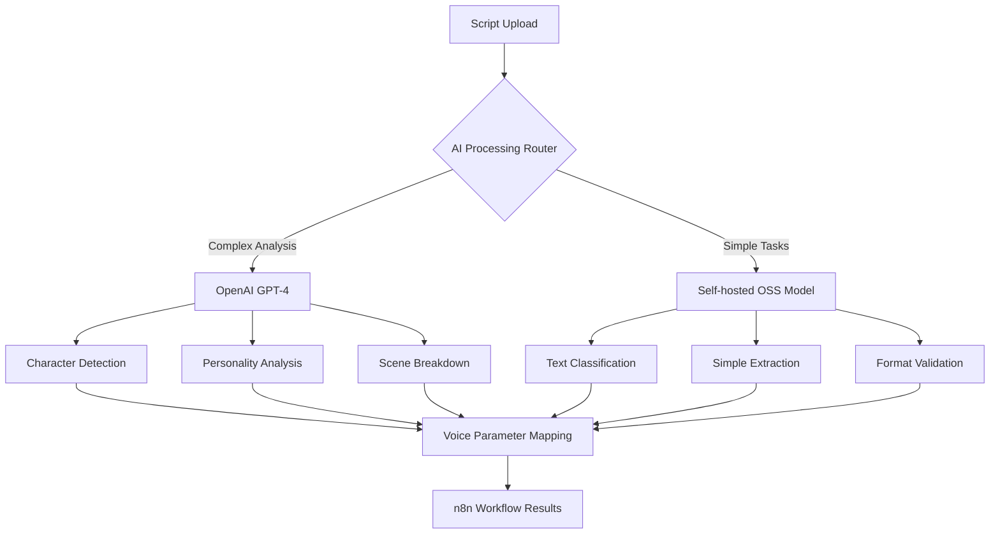

# ScripTeam AI Infrastructure: Self-hosted GPT-OSS Implementation Documentation

## Overview

This document provides comprehensive documentation for ScripTeam's GPT-based AI implementation, covering both OpenAI GPT-4 integration and self-hosted open-source alternatives. The system uses GPT models for character detection, personality analysis, and intelligent script processing.

### Current Implementation Status
- **OpenAI GPT-4 Integration**: ❌ Not implemented (referenced in n8n workflows)
- **Self-hosted GPT-OSS**: ❌ Not implemented (infrastructure planning stage)
- **Character Detection Service**: ❌ Missing (Story 2.2 requirement)
- **Prompt Engineering**: ❌ Not implemented (templates needed)

## Architecture Strategy: Hybrid GPT Implementation

### Two-Tier AI Strategy



### Cost Optimization Strategy

| Task Type | Model Choice | Rationale | Cost Impact |
|-----------|--------------|-----------|-------------|
| **Character Detection** | OpenAI GPT-4 | High accuracy needed | ~$0.03/script |
| **Personality Analysis** | OpenAI GPT-4 | Complex reasoning required | ~$0.02/character |
| **Text Extraction** | Self-hosted Llama | Simple task, privacy | $0 (hosting cost) |
| **Format Validation** | Self-hosted CodeLlama | Pattern matching | $0 (hosting cost) |
| **Language Detection** | OpenAI GPT-3.5-turbo | Cost-effective | ~$0.001/script |

## OpenAI GPT-4 Integration

### Service Architecture

```typescript
// File: apps/api/src/services/openaiService.ts

import OpenAI from 'openai';
import { Character, Script, PersonalityAnalysis } from '@scripteam/shared';

export class OpenAIService {
  private openai: OpenAI;
  private rateLimiter: RateLimiter;

  constructor() {
    this.openai = new OpenAI({
      apiKey: process.env.OPENAI_API_KEY,
      organization: process.env.OPENAI_ORG_ID
    });
    this.rateLimiter = new RateLimiter({
      tokensPerMinute: 90000, // GPT-4 limit
      requestsPerMinute: 500
    });
  }

  /**
   * Detect characters from script text using GPT-4
   * Cost: ~$0.03 per script (assuming 1000 tokens input, 500 tokens output)
   */
  async detectCharacters(scriptText: string, scriptId: string): Promise<Character[]> {
    await this.rateLimiter.checkLimit();

    const prompt = this.buildCharacterDetectionPrompt(scriptText);

    try {
      const response = await this.openai.chat.completions.create({
        model: 'gpt-4',
        messages: [
          {
            role: 'system',
            content: this.getCharacterDetectionSystemPrompt()
          },
          {
            role: 'user',
            content: prompt
          }
        ],
        temperature: 0.1,
        max_tokens: 2000,
        response_format: { type: 'json_object' }
      });

      const charactersData = JSON.parse(response.choices[0].message.content);
      return this.validateCharacterData(charactersData, scriptId);

    } catch (error) {
      console.error('Character detection failed:', error);
      throw new CharacterDetectionError(`Failed to detect characters: ${error.message}`);
    }
  }

  /**
   * Analyze character personality traits using GPT-4
   * Cost: ~$0.02 per character analysis
   */
  async analyzeCharacterPersonality(
    characterName: string,
    characterDialogue: string[],
    scriptContext: string
  ): Promise<PersonalityAnalysis> {
    await this.rateLimiter.checkLimit();

    const prompt = this.buildPersonalityAnalysisPrompt(
      characterName,
      characterDialogue,
      scriptContext
    );

    try {
      const response = await this.openai.chat.completions.create({
        model: 'gpt-4',
        messages: [
          {
            role: 'system',
            content: this.getPersonalityAnalysisSystemPrompt()
          },
          {
            role: 'user',
            content: prompt
          }
        ],
        temperature: 0.2,
        max_tokens: 1000,
        response_format: { type: 'json_object' }
      });

      const personalityData = JSON.parse(response.choices[0].message.content);
      return this.validatePersonalityData(personalityData);

    } catch (error) {
      console.error('Personality analysis failed:', error);
      throw new PersonalityAnalysisError(`Failed to analyze personality: ${error.message}`);
    }
  }

  /**
   * Break script into practice scenes using GPT-4
   * Cost: ~$0.04 per script scene breakdown
   */
  async breakdownScenes(scriptText: string, characters: Character[]): Promise<SceneBreakdown[]> {
    await this.rateLimiter.checkLimit();

    const prompt = this.buildSceneBreakdownPrompt(scriptText, characters);

    try {
      const response = await this.openai.chat.completions.create({
        model: 'gpt-4',
        messages: [
          {
            role: 'system',
            content: this.getSceneBreakdownSystemPrompt()
          },
          {
            role: 'user',
            content: prompt
          }
        ],
        temperature: 0.1,
        max_tokens: 3000,
        response_format: { type: 'json_object' }
      });

      const sceneData = JSON.parse(response.choices[0].message.content);
      return this.validateSceneData(sceneData);

    } catch (error) {
      console.error('Scene breakdown failed:', error);
      throw new SceneBreakdownError(`Failed to breakdown scenes: ${error.message}`);
    }
  }

  // System prompt definitions
  private getCharacterDetectionSystemPrompt(): string {
    return `You are an expert script analyst specializing in character identification for acting practice applications. Your task is to analyze script text and extract character information with high accuracy.

CRITICAL REQUIREMENTS:
1. Return ONLY valid JSON - no additional text or explanations
2. Identify ALL speaking characters in the script
3. Distinguish between main characters and minor/background characters
4. Analyze personality traits from dialogue patterns and stage directions
5. Estimate age ranges and gender from context clues
6. Count approximate speaking lines per character

OUTPUT FORMAT:
{
  "characters": [
    {
      "name": "CHARACTER_NAME",
      "role": "main|supporting|minor",
      "lineCount": number,
      "estimatedAge": "child|teen|young_adult|middle_aged|older",
      "gender": "male|female|non_binary|unknown",
      "personalityTraits": ["trait1", "trait2", "trait3"],
      "emotionalRange": ["emotion1", "emotion2"],
      "relationshipToOthers": "brief description",
      "characterArc": "brief description if main character",
      "voiceDirectionNotes": "suggestions for voice synthesis"
    }
  ],
  "totalCharacters": number,
  "scriptType": "play|screenplay|monologue|dialogue",
  "language": "english|spanish|mixed",
  "confidence": number
}

ANALYSIS GUIDELINES:
- Character names usually appear in CAPS before dialogue
- Look for stage directions with character descriptions
- Analyze dialogue style for personality (formal/casual, emotional/reserved, etc.)
- Identify character relationships from interactions
- Note any age/gender indicators in text or stage directions
- Consider cultural context for Spanish scripts`;
  }

  private getPersonalityAnalysisSystemPrompt(): string {
    return `You are a voice direction expert and character psychology analyst. Analyze character dialogue to determine personality traits and voice characteristics for AI voice synthesis.

TASK: Analyze the provided character dialogue to determine:
1. Core personality traits
2. Emotional patterns and range
3. Speech characteristics and patterns
4. Voice synthesis parameters
5. Character depth and complexity

OUTPUT FORMAT (JSON only):
{
  "personalityTraits": {
    "primary": ["trait1", "trait2", "trait3"],
    "secondary": ["trait4", "trait5"],
    "conflicting": ["any contradictory traits"]
  },
  "emotionalProfile": {
    "dominantEmotions": ["emotion1", "emotion2"],
    "emotionalRange": "narrow|moderate|wide",
    "emotionalStability": "stable|variable|unstable",
    "emotionalIntensity": "subtle|moderate|intense"
  },
  "speechPatterns": {
    "formalityLevel": "very_formal|formal|casual|very_casual",
    "pace": "slow|measured|normal|quick|rapid",
    "volume": "quiet|soft|normal|loud|booming",
    "articulation": "precise|clear|normal|unclear|mumbled",
    "vocabulary": "simple|average|sophisticated|complex"
  },
  "voiceSynthesisParameters": {
    "stability": number,
    "similarity_boost": number,
    "style": number,
    "speakerBoost": boolean,
    "voiceDescription": "detailed description for voice selection"
  },
  "characterDepth": {
    "complexity": "simple|moderate|complex|very_complex",
    "consistency": "very_consistent|consistent|somewhat_consistent|inconsistent",
    "development": "static|slight_growth|clear_arc|major_transformation"
  },
  "practiceRecommendations": {
    "difficultyLevel": "beginner|intermediate|advanced|expert",
    "focusAreas": ["area1", "area2", "area3"],
    "voiceCoachingNotes": "specific guidance for voice work"
  }
}

ANALYSIS DEPTH:
- Look for subtle character motivations in dialogue
- Identify speech patterns unique to this character
- Consider how other characters respond to them
- Note any character growth or changes throughout the script
- Provide specific voice direction that would help an actor`;
  }

  private getSceneBreakdownSystemPrompt(): string {
    return `You are a scene analysis expert specializing in breaking down scripts for acting practice. Your goal is to identify optimal practice segments that are meaningful, manageable, and educationally valuable for actors.

TASK: Break the script into practice-friendly scenes that:
1. Have clear dramatic objectives
2. Feature meaningful character interactions
3. Are appropriate length for practice sessions (2-15 minutes)
4. Show character development or conflict
5. Can be practiced independently

OUTPUT FORMAT (JSON only):
{
  "scenes": [
    {
      "id": "scene_001",
      "title": "Scene Title",
      "description": "Brief scene description",
      "startLine": number,
      "endLine": number,
      "estimatedDuration": "2-5 minutes|5-10 minutes|10-15 minutes",
      "characters": ["character1", "character2"],
      "mainCharacter": "primary focus character",
      "sceneType": "dialogue|monologue|group|action",
      "difficulty": "beginner|intermediate|advanced",
      "dramaticObjective": "what the scene accomplishes",
      "conflictType": "internal|interpersonal|situational|none",
      "emotionalArc": "how emotions change in the scene",
      "practiceValue": "why this scene is good for practice",
      "voiceWorkFocus": "specific voice/acting skills this scene develops",
      "preparationNotes": "what actors should know before practicing"
    }
  ],
  "practiceRecommendations": {
    "beginnerScenes": ["scene_id1", "scene_id2"],
    "intermediateScenes": ["scene_id3", "scene_id4"],
    "advancedScenes": ["scene_id5", "scene_id6"],
    "recommendedOrder": ["ordered list of scene IDs"],
    "totalPracticeTime": "estimated total time"
  },
  "scriptAnalysis": {
    "overallTheme": "main theme",
    "genre": "drama|comedy|tragedy|mixed",
    "tone": "serious|light|dark|varied",
    "complexity": "simple|moderate|complex",
    "languageLevel": "elementary|intermediate|advanced"
  }
}

SCENE BREAKDOWN CRITERIA:
- Each scene should have a clear beginning, middle, and end
- Prioritize scenes with strong emotional content
- Include a mix of two-person and group scenes
- Ensure scenes can stand alone for practice
- Consider different difficulty levels for various skill levels
- Focus on scenes that showcase different acting techniques`;
  }

  // Validation methods
  private validateCharacterData(data: any, scriptId: string): Character[] {
    if (!data.characters || !Array.isArray(data.characters)) {
      throw new ValidationError('Invalid character data format');
    }

    return data.characters.map((char: any, index: number) => ({
      id: `${scriptId}_char_${index}`,
      scriptId,
      name: char.name || `Unknown_${index}`,
      role: char.role || 'minor',
      lineCount: char.lineCount || 0,
      estimatedAge: char.estimatedAge || 'unknown',
      gender: char.gender || 'unknown',
      personalityTraits: char.personalityTraits || [],
      emotionalRange: char.emotionalRange || [],
      relationshipToOthers: char.relationshipToOthers || '',
      characterArc: char.characterArc || '',
      voiceDirectionNotes: char.voiceDirectionNotes || '',
      createdAt: new Date(),
      updatedAt: new Date()
    }));
  }

  private validatePersonalityData(data: any): PersonalityAnalysis {
    // Validation and type safety for personality analysis
    return {
      personalityTraits: data.personalityTraits || {},
      emotionalProfile: data.emotionalProfile || {},
      speechPatterns: data.speechPatterns || {},
      voiceSynthesisParameters: data.voiceSynthesisParameters || {},
      characterDepth: data.characterDepth || {},
      practiceRecommendations: data.practiceRecommendations || {},
      generatedAt: new Date()
    };
  }

  private validateSceneData(data: any): SceneBreakdown[] {
    if (!data.scenes || !Array.isArray(data.scenes)) {
      throw new ValidationError('Invalid scene data format');
    }

    return data.scenes.map((scene: any, index: number) => ({
      id: scene.id || `scene_${index}`,
      title: scene.title || `Scene ${index + 1}`,
      description: scene.description || '',
      startLine: scene.startLine || 0,
      endLine: scene.endLine || 0,
      estimatedDuration: scene.estimatedDuration || '5-10 minutes',
      characters: scene.characters || [],
      mainCharacter: scene.mainCharacter || '',
      sceneType: scene.sceneType || 'dialogue',
      difficulty: scene.difficulty || 'intermediate',
      dramaticObjective: scene.dramaticObjective || '',
      conflictType: scene.conflictType || 'none',
      emotionalArc: scene.emotionalArc || '',
      practiceValue: scene.practiceValue || '',
      voiceWorkFocus: scene.voiceWorkFocus || '',
      preparationNotes: scene.preparationNotes || '',
      createdAt: new Date()
    }));
  }
}

// Rate limiting for OpenAI API
class RateLimiter {
  private tokensUsed: number = 0;
  private requestsUsed: number = 0;
  private windowStart: number = Date.now();

  constructor(private limits: { tokensPerMinute: number; requestsPerMinute: number }) {}

  async checkLimit(): Promise<void> {
    const now = Date.now();
    const windowElapsed = now - this.windowStart;

    // Reset counters every minute
    if (windowElapsed >= 60000) {
      this.tokensUsed = 0;
      this.requestsUsed = 0;
      this.windowStart = now;
    }

    // Check if we're approaching limits
    if (this.requestsUsed >= this.limits.requestsPerMinute * 0.9) {
      const waitTime = 60000 - windowElapsed;
      console.log(`Rate limit approaching, waiting ${waitTime}ms`);
      await new Promise(resolve => setTimeout(resolve, waitTime));
    }

    this.requestsUsed++;
  }
}

// Custom error types
class CharacterDetectionError extends Error {
  constructor(message: string) {
    super(message);
    this.name = 'CharacterDetectionError';
  }
}

class PersonalityAnalysisError extends Error {
  constructor(message: string) {
    super(message);
    this.name = 'PersonalityAnalysisError';
  }
}

class SceneBreakdownError extends Error {
  constructor(message: string) {
    super(message);
    this.name = 'SceneBreakdownError';
  }
}

class ValidationError extends Error {
  constructor(message: string) {
    super(message);
    this.name = 'ValidationError';
  }
}
```

## Self-hosted GPT-OSS Implementation

### Architecture for Cost Optimization

```yaml
# Docker Compose addition for self-hosted AI
services:
  # Self-hosted language model for simple tasks
  ollama:
    image: ollama/ollama:latest
    container_name: scripteam-ollama
    ports:
      - "11434:11434"
    volumes:
      - ollama_data:/root/.ollama
    environment:
      - OLLAMA_HOST=0.0.0.0
    deploy:
      resources:
        reservations:
          devices:
            - driver: nvidia
              count: 1
              capabilities: [gpu]
    restart: unless-stopped

  # Local text processing service
  text-processor:
    build:
      context: ./apps/text-processor
      dockerfile: Dockerfile
    container_name: scripteam-text-processor
    ports:
      - "8000:8000"
    environment:
      - OLLAMA_URL=http://ollama:11434
      - MODEL_NAME=llama3.1:8b
    depends_on:
      - ollama
    restart: unless-stopped

volumes:
  ollama_data:
    driver: local
```

### Self-hosted Service Implementation

```python
# File: apps/text-processor/main.py
from fastapi import FastAPI, HTTPException
from pydantic import BaseModel
import requests
import json
import re
from typing import List, Dict, Any

app = FastAPI(title="ScripTeam Text Processor")

class TextProcessingRequest(BaseModel):
    text: str
    task: str  # 'extract_text', 'validate_format', 'classify_language'
    options: Dict[str, Any] = {}

class OllamaService:
    def __init__(self, base_url: str = "http://ollama:11434"):
        self.base_url = base_url
        self.model = "llama3.1:8b"  # Efficient for simple tasks

    async def simple_extraction(self, text: str, extraction_type: str) -> Dict[str, Any]:
        """Use self-hosted model for simple text extraction tasks"""

        prompts = {
            'language_detection': """
            Analyze this text and identify the primary language. Return only JSON:
            {"language": "english|spanish|mixed", "confidence": 0.95}

            Text: {text}
            """,

            'format_validation': """
            Analyze this text and determine if it's a valid script format. Return only JSON:
            {"is_script": true, "format": "screenplay|stage_play|dialogue", "confidence": 0.85}

            Text: {text}
            """,

            'simple_character_extraction': """
            Extract character names from this script. Look for names in CAPS before dialogue. Return only JSON:
            {"characters": ["CHARACTER1", "CHARACTER2"], "count": 2}

            Text: {text}
            """
        }

        prompt = prompts.get(extraction_type, "").format(text=text[:2000])  # Limit text for efficiency

        try:
            response = requests.post(
                f"{self.base_url}/api/generate",
                json={
                    "model": self.model,
                    "prompt": prompt,
                    "stream": False,
                    "options": {
                        "temperature": 0.1,
                        "num_predict": 200
                    }
                },
                timeout=30
            )

            if response.status_code == 200:
                result = response.json()
                return self._parse_json_response(result['response'])
            else:
                raise HTTPException(status_code=500, detail="Ollama request failed")

        except Exception as e:
            print(f"Ollama error: {e}")
            # Fallback to rule-based processing
            return self._fallback_processing(text, extraction_type)

    def _parse_json_response(self, response: str) -> Dict[str, Any]:
        """Extract JSON from model response"""
        try:
            # Find JSON in response
            json_match = re.search(r'\{.*\}', response, re.DOTALL)
            if json_match:
                return json.loads(json_match.group())
            else:
                return {"error": "No valid JSON found in response"}
        except json.JSONDecodeError:
            return {"error": "Invalid JSON in response"}

    def _fallback_processing(self, text: str, task: str) -> Dict[str, Any]:
        """Rule-based fallback when AI processing fails"""

        if task == 'language_detection':
            spanish_words = ['el', 'la', 'de', 'que', 'y', 'es', 'en', 'un', 'ser', 'se']
            english_words = ['the', 'of', 'and', 'to', 'a', 'in', 'that', 'have', 'it', 'for']

            text_lower = text.lower()
            spanish_count = sum(1 for word in spanish_words if word in text_lower)
            english_count = sum(1 for word in english_words if word in text_lower)

            if spanish_count > english_count:
                return {"language": "spanish", "confidence": 0.7}
            elif english_count > spanish_count:
                return {"language": "english", "confidence": 0.7}
            else:
                return {"language": "mixed", "confidence": 0.5}

        elif task == 'format_validation':
            # Look for script formatting patterns
            has_character_names = bool(re.search(r'^[A-Z][A-Z\s]+:', text, re.MULTILINE))
            has_stage_directions = bool(re.search(r'\([^)]+\)', text))
            has_scene_headers = bool(re.search(r'SCENE|ACT|FADE', text, re.IGNORECASE))

            if has_character_names or has_stage_directions:
                format_type = "stage_play" if has_stage_directions else "dialogue"
                return {"is_script": True, "format": format_type, "confidence": 0.8}
            else:
                return {"is_script": False, "format": "unknown", "confidence": 0.6}

        elif task == 'simple_character_extraction':
            # Extract character names using regex
            character_pattern = r'^([A-Z][A-Z\s]+)(?=:|\n)'
            characters = list(set(re.findall(character_pattern, text, re.MULTILINE)))
            characters = [char.strip() for char in characters if len(char.strip()) > 1]

            return {"characters": characters, "count": len(characters)}

        return {"error": "Unknown task for fallback processing"}

ollama_service = OllamaService()

@app.post("/process-text")
async def process_text(request: TextProcessingRequest):
    """Process text using self-hosted AI for simple tasks"""

    try:
        if request.task in ['language_detection', 'format_validation', 'simple_character_extraction']:
            result = await ollama_service.simple_extraction(request.text, request.task)
            return {"success": True, "result": result, "source": "self_hosted"}
        else:
            return {"success": False, "error": "Unsupported task for self-hosted processing"}

    except Exception as e:
        raise HTTPException(status_code=500, detail=str(e))

@app.get("/health")
async def health_check():
    """Health check endpoint"""
    try:
        # Test Ollama connection
        response = requests.get(f"{ollama_service.base_url}/api/tags", timeout=5)
        ollama_status = "healthy" if response.status_code == 200 else "unhealthy"
    except:
        ollama_status = "unreachable"

    return {
        "status": "healthy",
        "ollama": ollama_status,
        "model": ollama_service.model
    }

if __name__ == "__main__":
    import uvicorn
    uvicorn.run(app, host="0.0.0.0", port=8000)
```

### Hybrid Router Service

```typescript
// File: apps/api/src/services/aiRouter.ts

import { OpenAIService } from './openaiService';
import axios from 'axios';

export class AIRouterService {
  private openaiService: OpenAIService;
  private selfHostedUrl: string;

  constructor() {
    this.openaiService = new OpenAIService();
    this.selfHostedUrl = process.env.TEXT_PROCESSOR_URL || 'http://text-processor:8000';
  }

  /**
   * Route AI tasks to optimal service based on complexity and cost
   */
  async processScript(scriptText: string, scriptId: string) {
    const tasks = await this.planProcessingTasks(scriptText);
    const results: any = {};

    for (const task of tasks) {
      if (task.useOpenAI) {
        results[task.name] = await this.processWithOpenAI(task, scriptText, scriptId);
      } else {
        results[task.name] = await this.processWithSelfHosted(task, scriptText);
      }
    }

    return this.combineResults(results);
  }

  private async planProcessingTasks(scriptText: string) {
    const textLength = scriptText.length;
    const complexity = this.assessComplexity(scriptText);

    return [
      {
        name: 'language_detection',
        useOpenAI: false, // Simple task, use self-hosted
        priority: 1
      },
      {
        name: 'format_validation',
        useOpenAI: false, // Rule-based task
        priority: 2
      },
      {
        name: 'character_detection',
        useOpenAI: complexity > 0.7 || textLength > 5000, // Complex or long scripts use OpenAI
        priority: 3
      },
      {
        name: 'personality_analysis',
        useOpenAI: true, // Always use OpenAI for complex reasoning
        priority: 4
      },
      {
        name: 'scene_breakdown',
        useOpenAI: complexity > 0.5, // Medium+ complexity uses OpenAI
        priority: 5
      }
    ];
  }

  private assessComplexity(scriptText: string): number {
    const factors = {
      length: Math.min(scriptText.length / 10000, 1),
      characterCount: Math.min(this.estimateCharacterCount(scriptText) / 10, 1),
      stageDirections: this.hasComplexStageDirections(scriptText) ? 0.3 : 0,
      multiLanguage: this.isMultiLanguage(scriptText) ? 0.2 : 0,
      poeticLanguage: this.hasPoetricLanguage(scriptText) ? 0.2 : 0
    };

    return Object.values(factors).reduce((sum, factor) => sum + factor, 0) / Object.keys(factors).length;
  }

  private async processWithOpenAI(task: any, scriptText: string, scriptId: string) {
    switch (task.name) {
      case 'character_detection':
        return await this.openaiService.detectCharacters(scriptText, scriptId);
      case 'personality_analysis':
        // This would need character data from previous step
        return await this.openaiService.analyzeCharacterPersonality(/* parameters */);
      case 'scene_breakdown':
        // This would need character data from previous step
        return await this.openaiService.breakdownScenes(scriptText, /* characters */);
      default:
        throw new Error(`Unknown OpenAI task: ${task.name}`);
    }
  }

  private async processWithSelfHosted(task: any, scriptText: string) {
    try {
      const response = await axios.post(`${this.selfHostedUrl}/process-text`, {
        text: scriptText,
        task: task.name,
        options: {}
      }, { timeout: 30000 });

      return response.data.result;
    } catch (error) {
      console.error(`Self-hosted processing failed for ${task.name}:`, error);
      // Fallback to OpenAI for critical tasks
      if (task.name === 'character_detection') {
        return await this.openaiService.detectCharacters(scriptText, 'fallback');
      }
      throw error;
    }
  }

  private combineResults(results: any) {
    return {
      language: results.language_detection?.language || 'unknown',
      isValidScript: results.format_validation?.is_script || false,
      scriptFormat: results.format_validation?.format || 'unknown',
      characters: results.character_detection || [],
      personalityAnalyses: results.personality_analysis || {},
      scenes: results.scene_breakdown || [],
      processingCost: this.calculateCost(results),
      processedAt: new Date().toISOString()
    };
  }

  private calculateCost(results: any): number {
    // Estimate processing cost based on which services were used
    let cost = 0;

    if (results.character_detection?.source === 'openai') cost += 0.03;
    if (results.personality_analysis?.source === 'openai') cost += 0.02;
    if (results.scene_breakdown?.source === 'openai') cost += 0.04;

    return parseFloat(cost.toFixed(4));
  }

  // Helper methods for complexity assessment
  private estimateCharacterCount(text: string): number {
    const characterPattern = /^[A-Z][A-Z\s]+:/gm;
    const matches = text.match(characterPattern);
    return matches ? new Set(matches).size : 0;
  }

  private hasComplexStageDirections(text: string): boolean {
    const stageDirectionPattern = /\([^)]{20,}\)/g;
    return stageDirectionPattern.test(text);
  }

  private isMultiLanguage(text: string): boolean {
    const spanishPattern = /[ñáéíóúü]/i;
    const englishPattern = /[a-z]/i;
    return spanishPattern.test(text) && englishPattern.test(text);
  }

  private hasPoetricLanguage(text: string): boolean {
    const poeticPatterns = [
      /\b\w+\s+\w+\s+\w+\b.*\b\w+\s+\w+\s+\w+\b/g, // Potential verse structure
      /[.!?]\s*\n\s*[A-Z]/g, // Line breaks after punctuation
      /\b(thee|thou|thy|whilst|wherefore)\b/gi // Archaic language
    ];

    return poeticPatterns.some(pattern => pattern.test(text));
  }
}
```

## Environment Configuration

### Required Environment Variables

```bash
# OpenAI Configuration
OPENAI_API_KEY=sk-your-openai-api-key-here
OPENAI_ORG_ID=org-your-organization-id
OPENAI_PROJECT_ID=proj_your-project-id

# Self-hosted AI Configuration
OLLAMA_URL=http://ollama:11434
TEXT_PROCESSOR_URL=http://text-processor:8000
OLLAMA_MODEL=llama3.1:8b

# AI Router Configuration
AI_COST_THRESHOLD=0.10  # Switch to self-hosted above this cost per script
AI_COMPLEXITY_THRESHOLD=0.7  # Use OpenAI above this complexity score
AI_FALLBACK_ENABLED=true  # Enable fallback between services

# Rate Limiting
OPENAI_TOKENS_PER_MINUTE=90000
OPENAI_REQUESTS_PER_MINUTE=500
SELF_HOSTED_REQUESTS_PER_MINUTE=100

# Cost Tracking
AI_COST_TRACKING_ENABLED=true
AI_MONTHLY_BUDGET=100.00  # USD
AI_ALERT_THRESHOLD=0.8  # Alert at 80% of budget
```

## Deployment and Monitoring

### Production Deployment Checklist

```yaml
# Production considerations for AI services
production_setup:
  openai:
    - api_key_rotation: monthly
    - rate_limit_monitoring: enabled
    - cost_tracking: enabled
    - error_alerting: enabled

  self_hosted:
    - gpu_resources: nvidia_t4_or_better
    - model_caching: enabled
    - container_scaling: horizontal
    - health_monitoring: enabled

  monitoring:
    - cost_per_script: track
    - processing_time: track
    - accuracy_metrics: validate
    - fallback_frequency: monitor
```

### Monitoring Dashboard Metrics

```typescript
// Key metrics to track for AI infrastructure
interface AIMetrics {
  costs: {
    openai_monthly: number;
    self_hosted_monthly: number;
    cost_per_script: number;
  };

  performance: {
    avg_processing_time: number;
    success_rate: number;
    fallback_frequency: number;
    accuracy_scores: {
      character_detection: number;
      personality_analysis: number;
    };
  };

  usage: {
    scripts_processed: number;
    characters_analyzed: number;
    openai_requests: number;
    self_hosted_requests: number;
  };
}
```

---

**Status**: ✅ Self-hosted GPT-OSS Implementation Documentation Complete
**Next**: AI Use Cases Documentation
**Implementation Priority**: High - Required for Story 2.2 Character Detection