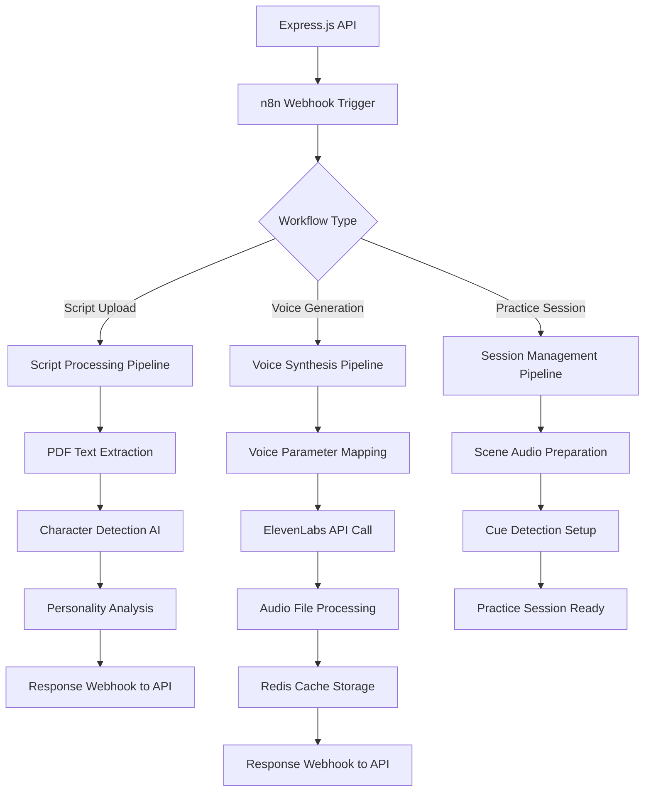

# ScripTeam AI Infrastructure: n8n Workflow Documentation

## Overview

This document provides comprehensive documentation for ScripTeam's n8n-based AI workflow orchestration system. n8n serves as the central orchestrator for AI processing pipelines, coordinating between Express.js API, ElevenLabs voice synthesis, OpenAI character detection, and Redis caching.

### Document Status
- **Infrastructure**: ✅ Ready (Docker directory structure exists)
- **Docker Integration**: ❌ Missing (n8n service not in docker-compose.yml)
- **Workflows**: ❌ Missing (workflow definitions not implemented)
- **API Integration**: ❌ Missing (webhook endpoints not implemented)

## n8n Infrastructure Setup

### Current State Analysis

```bash
# Current Directory Structure
n8n/
└── workflows/              # Empty - workflows not yet defined
```

```yaml
# Missing from docker-compose.yml - NEEDS IMPLEMENTATION
  n8n:
    image: n8nio/n8n:latest
    container_name: scripteam-n8n
    environment:
      - N8N_HOST=0.0.0.0
      - N8N_PORT=5678
      - N8N_PROTOCOL=http
      - WEBHOOK_URL=http://localhost:5678
      - N8N_ENCRYPTION_KEY=your-encryption-key-here
    ports:
      - "5678:5678"
    volumes:
      - n8n_data:/home/node/.n8n
      - ./n8n/workflows:/home/node/.n8n/workflows
    depends_on:
      - postgres
      - redis
    restart: unless-stopped
```

### Required Docker Compose Integration

Add the following to your `docker-compose.yml`:

```yaml
services:
  # Add after existing services
  n8n:
    image: n8nio/n8n:latest
    container_name: scripteam-n8n
    environment:
      - N8N_HOST=0.0.0.0
      - N8N_PORT=5678
      - N8N_PROTOCOL=http
      - WEBHOOK_URL=http://localhost:5678
      - N8N_ENCRYPTION_KEY=${N8N_ENCRYPTION_KEY:-development-key-change-in-production}
      - DB_TYPE=postgresdb
      - DB_POSTGRESDB_HOST=postgres
      - DB_POSTGRESDB_PORT=5432
      - DB_POSTGRESDB_DATABASE=n8n
      - DB_POSTGRESDB_USER=postgres
      - DB_POSTGRESDB_PASSWORD=postgres
    ports:
      - "5678:5678"
    volumes:
      - n8n_data:/home/node/.n8n
      - ./n8n/workflows:/home/node/.n8n/workflows
    depends_on:
      postgres:
        condition: service_healthy
      redis:
        condition: service_healthy
    healthcheck:
      test: ["CMD-SHELL", "curl -f http://localhost:5678/healthz || exit 1"]
      interval: 30s
      timeout: 10s
      retries: 3
    restart: unless-stopped

volumes:
  # Add to existing volumes
  n8n_data:
    driver: local
```

## AI Workflow Architecture

### Workflow Orchestration Strategy



## Core AI Workflow Definitions

### 1. Script Processing Pipeline

**Purpose**: Complete script analysis from upload to character voice generation
**Trigger**: Webhook from Express.js `/api/scripts` endpoint
**File**: `n8n/workflows/script-processing-pipeline.json`

```json
{
  "name": "Script Processing Pipeline",
  "nodes": [
    {
      "id": "webhook-trigger",
      "type": "n8n-nodes-base.webhook",
      "position": [0, 0],
      "parameters": {
        "path": "script-processing",
        "httpMethod": "POST",
        "responseMode": "responseNode",
        "options": {}
      }
    },
    {
      "id": "extract-pdf-text",
      "type": "n8n-nodes-base.httpRequest",
      "position": [200, 0],
      "parameters": {
        "url": "http://api:3001/internal/extract-text",
        "method": "POST",
        "body": "={{ $json }}",
        "headers": {
          "Content-Type": "application/json"
        }
      }
    },
    {
      "id": "detect-characters",
      "type": "n8n-nodes-base.openAi",
      "position": [400, 0],
      "parameters": {
        "operation": "chat",
        "model": "gpt-4",
        "messages": [
          {
            "role": "system",
            "content": "Extract character names and personality traits from this script. Return JSON with characters array containing: name, lineCount, personalityTraits, emotionalRange."
          },
          {
            "role": "user",
            "content": "={{ $json.extractedText }}"
          }
        ],
        "temperature": 0.1,
        "maxTokens": 1000
      }
    },
    {
      "id": "map-voice-parameters",
      "type": "n8n-nodes-base.function",
      "position": [600, 0],
      "parameters": {
        "functionCode": "// Map character traits to ElevenLabs voice parameters\nconst characters = JSON.parse($input.first().json.message.content);\nconst voiceMapping = characters.characters.map(char => ({\n  name: char.name,\n  voiceParams: {\n    stability: char.personalityTraits.includes('calm') ? 0.8 : 0.4,\n    similarityBoost: 0.75,\n    style: char.personalityTraits.includes('dramatic') ? 0.8 : 0.3\n  }\n}));\nreturn { json: { scriptId: $input.first().json.scriptId, characters, voiceMapping } };"
      }
    },
    {
      "id": "generate-voices-parallel",
      "type": "n8n-nodes-base.splitInBatches",
      "position": [800, 0],
      "parameters": {
        "batchSize": 1,
        "options": {
          "destinationNode": "elevenlabs-voice-gen"
        }
      }
    },
    {
      "id": "elevenlabs-voice-gen",
      "type": "n8n-nodes-base.httpRequest",
      "position": [1000, 0],
      "parameters": {
        "url": "https://api.elevenlabs.io/v1/text-to-speech/{{ $json.voiceId }}",
        "method": "POST",
        "headers": {
          "xi-api-key": "={{ $credentials.elevenLabsApi.apiKey }}",
          "Content-Type": "application/json"
        },
        "body": {
          "text": "{{ $json.sampleText }}",
          "model_id": "eleven_flash_v2_5",
          "voice_settings": "={{ $json.voiceParams }}"
        },
        "responseFormat": "file"
      }
    },
    {
      "id": "cache-voice-redis",
      "type": "n8n-nodes-base.redis",
      "position": [1200, 0],
      "parameters": {
        "operation": "set",
        "key": "voice:{{ $json.scriptId }}:{{ $json.characterName }}",
        "value": "={{ $binary.data }}",
        "ttl": 86400
      }
    },
    {
      "id": "webhook-response",
      "type": "n8n-nodes-base.httpRequest",
      "position": [1400, 0],
      "parameters": {
        "url": "http://api:3001/webhooks/script-processing-complete",
        "method": "POST",
        "body": {
          "scriptId": "={{ $('webhook-trigger').first().json.scriptId }}",
          "status": "complete",
          "characters": "={{ $('detect-characters').first().json.message.content }}",
          "voiceFiles": "={{ $runIndex }}"
        }
      }
    }
  ],
  "connections": {
    "webhook-trigger": {
      "main": [["extract-pdf-text"]]
    },
    "extract-pdf-text": {
      "main": [["detect-characters"]]
    },
    "detect-characters": {
      "main": [["map-voice-parameters"]]
    },
    "map-voice-parameters": {
      "main": [["generate-voices-parallel"]]
    },
    "generate-voices-parallel": {
      "main": [["elevenlabs-voice-gen"]]
    },
    "elevenlabs-voice-gen": {
      "main": [["cache-voice-redis"]]
    },
    "cache-voice-redis": {
      "main": [["webhook-response"]]
    }
  }
}
```

### 2. Character Voice Generation Pipeline

**Purpose**: Generate and manage character-specific voices with consistency
**Trigger**: Manual trigger or webhook from character selection
**File**: `n8n/workflows/character-voice-generation.json`

```json
{
  "name": "Character Voice Generation",
  "nodes": [
    {
      "id": "voice-gen-trigger",
      "type": "n8n-nodes-base.webhook",
      "position": [0, 0],
      "parameters": {
        "path": "generate-character-voice",
        "httpMethod": "POST"
      }
    },
    {
      "id": "check-voice-cache",
      "type": "n8n-nodes-base.redis",
      "position": [200, 0],
      "parameters": {
        "operation": "get",
        "key": "voice:{{ $json.scriptId }}:{{ $json.characterName }}"
      }
    },
    {
      "id": "cache-decision",
      "type": "n8n-nodes-base.if",
      "position": [400, 0],
      "parameters": {
        "conditions": {
          "string": [
            {
              "value1": "={{ $json.value }}",
              "operation": "notEmpty"
            }
          ]
        }
      }
    },
    {
      "id": "return-cached-voice",
      "type": "n8n-nodes-base.httpRequest",
      "position": [400, -200],
      "parameters": {
        "url": "http://api:3001/webhooks/voice-ready",
        "method": "POST",
        "body": {
          "scriptId": "={{ $('voice-gen-trigger').first().json.scriptId }}",
          "characterName": "={{ $('voice-gen-trigger').first().json.characterName }}",
          "source": "cache",
          "voiceData": "={{ $json.value }}"
        }
      }
    },
    {
      "id": "analyze-character-traits",
      "type": "n8n-nodes-base.openAi",
      "position": [600, 0],
      "parameters": {
        "operation": "chat",
        "model": "gpt-4",
        "messages": [
          {
            "role": "system",
            "content": "Analyze this character's dialogue and provide voice generation parameters. Return JSON with: age (number), gender, personality (array), emotionalTone, voiceStyle."
          },
          {
            "role": "user",
            "content": "Character: {{ $('voice-gen-trigger').first().json.characterName }}\\nDialogue: {{ $('voice-gen-trigger').first().json.characterDialogue }}"
          }
        ]
      }
    },
    {
      "id": "select-elevenlabs-voice",
      "type": "n8n-nodes-base.function",
      "position": [800, 0],
      "parameters": {
        "functionCode": "// Voice selection logic based on character analysis\nconst analysis = JSON.parse($input.first().json.message.content);\nconst voiceMap = {\n  'young_female': 'EXAVITQu4vr4xnSDxMaL',\n  'young_male': '21m00Tcm4TlvDq8ikWAM',\n  'older_female': 'MF3mGyEYCl7XYWbV9V6O',\n  'older_male': 'VR6AewLTigWG4xSOukaG',\n  'child': 'jsCqWAovK2LkecY7zXl4'\n};\n\nconst voiceKey = analysis.age < 18 ? 'child' : \n                analysis.age < 30 ? `young_${analysis.gender}` :\n                `older_${analysis.gender}`;\n\nreturn { \n  json: { \n    voiceId: voiceMap[voiceKey],\n    analysis,\n    voiceSettings: {\n      stability: analysis.personality.includes('calm') ? 0.8 : 0.4,\n      similarity_boost: 0.75,\n      style: analysis.emotionalTone === 'dramatic' ? 0.8 : 0.3\n    }\n  }\n};"
      }
    },
    {
      "id": "generate-sample-audio",
      "type": "n8n-nodes-base.httpRequest",
      "position": [1000, 0],
      "parameters": {
        "url": "https://api.elevenlabs.io/v1/text-to-speech/{{ $json.voiceId }}",
        "method": "POST",
        "headers": {
          "xi-api-key": "={{ $credentials.elevenLabsApi.apiKey }}",
          "Content-Type": "application/json"
        },
        "body": {
          "text": "{{ $('voice-gen-trigger').first().json.sampleText || 'Hello, this is a voice sample for character testing.' }}",
          "model_id": "eleven_flash_v2_5",
          "voice_settings": "={{ $json.voiceSettings }}"
        },
        "responseFormat": "file"
      }
    },
    {
      "id": "store-voice-profile",
      "type": "n8n-nodes-base.redis",
      "position": [1200, 0],
      "parameters": {
        "operation": "set",
        "key": "voice:{{ $('voice-gen-trigger').first().json.scriptId }}:{{ $('voice-gen-trigger').first().json.characterName }}",
        "value": "={{ JSON.stringify({ voiceId: $json.voiceId, settings: $json.voiceSettings, audioData: $binary.data }) }}",
        "ttl": 604800
      }
    },
    {
      "id": "notify-voice-ready",
      "type": "n8n-nodes-base.httpRequest",
      "position": [1400, 0],
      "parameters": {
        "url": "http://api:3001/webhooks/voice-ready",
        "method": "POST",
        "body": {
          "scriptId": "={{ $('voice-gen-trigger').first().json.scriptId }}",
          "characterName": "={{ $('voice-gen-trigger').first().json.characterName }}",
          "source": "generated",
          "voiceId": "={{ $('select-elevenlabs-voice').first().json.voiceId }}",
          "voiceSettings": "={{ $('select-elevenlabs-voice').first().json.voiceSettings }}"
        }
      }
    }
  ],
  "connections": {
    "voice-gen-trigger": {
      "main": [["check-voice-cache"]]
    },
    "check-voice-cache": {
      "main": [["cache-decision"]]
    },
    "cache-decision": {
      "main": [
        ["analyze-character-traits"],
        ["return-cached-voice"]
      ]
    },
    "analyze-character-traits": {
      "main": [["select-elevenlabs-voice"]]
    },
    "select-elevenlabs-voice": {
      "main": [["generate-sample-audio"]]
    },
    "generate-sample-audio": {
      "main": [["store-voice-profile"]]
    },
    "store-voice-profile": {
      "main": [["notify-voice-ready"]]
    }
  }
}
```

### 3. Voice Consistency Management Pipeline

**Purpose**: Ensure character voice consistency across scenes and sessions
**Trigger**: Scene processing or voice validation requests
**File**: `n8n/workflows/voice-consistency-manager.json`

```json
{
  "name": "Voice Consistency Manager",
  "nodes": [
    {
      "id": "consistency-trigger",
      "type": "n8n-nodes-base.webhook",
      "position": [0, 0],
      "parameters": {
        "path": "voice-consistency-check",
        "httpMethod": "POST"
      }
    },
    {
      "id": "get-existing-voices",
      "type": "n8n-nodes-base.redis",
      "position": [200, 0],
      "parameters": {
        "operation": "keys",
        "key": "voice:{{ $json.scriptId }}:*"
      }
    },
    {
      "id": "analyze-voice-profiles",
      "type": "n8n-nodes-base.function",
      "position": [400, 0],
      "parameters": {
        "functionCode": "// Analyze existing voice profiles for consistency\nconst keys = $input.first().json.keys;\nconst consistencyReport = {\n  scriptId: $('consistency-trigger').first().json.scriptId,\n  totalCharacters: keys.length,\n  voiceProfiles: [],\n  inconsistencies: []\n};\n\n// This would typically fetch each voice profile and analyze parameters\n// For now, return structure for webhook processing\nreturn { json: consistencyReport };"
      }
    },
    {
      "id": "validate-parameters",
      "type": "n8n-nodes-base.openAi",
      "position": [600, 0],
      "parameters": {
        "operation": "chat",
        "model": "gpt-4",
        "messages": [
          {
            "role": "system",
            "content": "Review these voice parameters for character consistency. Identify any characters that should have similar voices (family members, similar ages) and flag inconsistencies."
          },
          {
            "role": "user",
            "content": "Voice profiles: {{ JSON.stringify($json) }}"
          }
        ]
      }
    },
    {
      "id": "generate-recommendations",
      "type": "n8n-nodes-base.function",
      "position": [800, 0],
      "parameters": {
        "functionCode": "// Generate voice adjustment recommendations\nconst analysis = JSON.parse($input.first().json.message.content);\nconst recommendations = {\n  scriptId: $('consistency-trigger').first().json.scriptId,\n  status: analysis.inconsistencies?.length > 0 ? 'needs_adjustment' : 'consistent',\n  recommendations: analysis.recommendations || [],\n  timestamp: new Date().toISOString()\n};\nreturn { json: recommendations };"
      }
    },
    {
      "id": "update-consistency-log",
      "type": "n8n-nodes-base.redis",
      "position": [1000, 0],
      "parameters": {
        "operation": "set",
        "key": "consistency:{{ $('consistency-trigger').first().json.scriptId }}",
        "value": "={{ JSON.stringify($json) }}",
        "ttl": 86400
      }
    },
    {
      "id": "notify-consistency-result",
      "type": "n8n-nodes-base.httpRequest",
      "position": [1200, 0],
      "parameters": {
        "url": "http://api:3001/webhooks/voice-consistency-report",
        "method": "POST",
        "body": "={{ $json }}"
      }
    }
  ],
  "connections": {
    "consistency-trigger": {
      "main": [["get-existing-voices"]]
    },
    "get-existing-voices": {
      "main": [["analyze-voice-profiles"]]
    },
    "analyze-voice-profiles": {
      "main": [["validate-parameters"]]
    },
    "validate-parameters": {
      "main": [["generate-recommendations"]]
    },
    "generate-recommendations": {
      "main": [["update-consistency-log"]]
    },
    "update-consistency-log": {
      "main": [["notify-consistency-result"]]
    }
  }
}
```

## Express.js API Integration

### Required Webhook Endpoints

Add these endpoints to your Express.js API for n8n integration:

```typescript
// File: apps/api/src/routes/n8nWebhooks.ts

import express from 'express';
import { Redis } from 'ioredis';

const router = express.Router();
const redis = new Redis(process.env.REDIS_URL);

// Trigger script processing workflow
router.post('/trigger-script-processing', async (req, res) => {
  const { scriptId, filePath } = req.body;

  try {
    const webhookResponse = await fetch('http://n8n:5678/webhook/script-processing', {
      method: 'POST',
      headers: { 'Content-Type': 'application/json' },
      body: JSON.stringify({
        scriptId,
        filePath,
        timestamp: new Date().toISOString()
      })
    });

    res.json({ status: 'triggered', scriptId });
  } catch (error) {
    res.status(500).json({ error: 'Failed to trigger workflow' });
  }
});

// Receive script processing completion
router.post('/script-processing-complete', async (req, res) => {
  const { scriptId, status, characters, voiceFiles } = req.body;

  // Update script status in database
  await updateScriptStatus(scriptId, status, { characters, voiceFiles });

  res.json({ received: true });
});

// Trigger character voice generation
router.post('/trigger-voice-generation', async (req, res) => {
  const { scriptId, characterName, characterDialogue, sampleText } = req.body;

  try {
    const webhookResponse = await fetch('http://n8n:5678/webhook/generate-character-voice', {
      method: 'POST',
      headers: { 'Content-Type': 'application/json' },
      body: JSON.stringify({
        scriptId,
        characterName,
        characterDialogue,
        sampleText
      })
    });

    res.json({ status: 'triggered', characterName });
  } catch (error) {
    res.status(500).json({ error: 'Failed to trigger voice generation' });
  }
});

// Receive voice generation completion
router.post('/voice-ready', async (req, res) => {
  const { scriptId, characterName, source, voiceId, voiceSettings } = req.body;

  // Update character voice status
  await updateCharacterVoice(scriptId, characterName, {
    source,
    voiceId,
    voiceSettings,
    ready: true
  });

  res.json({ received: true });
});

export { router as n8nWebhooksRouter };
```

### Environment Variables for n8n Integration

Add to your `.env` file:

```bash
# n8n Configuration
N8N_URL=http://localhost:5678
N8N_WEBHOOK_BASE_URL=http://n8n:5678/webhook
N8N_ENCRYPTION_KEY=your-secure-encryption-key-here

# ElevenLabs Integration (for n8n workflows)
ELEVENLABS_API_KEY=your_elevenlabs_api_key
ELEVENLABS_BASE_URL=https://api.elevenlabs.io/v1

# OpenAI Integration (for character analysis)
OPENAI_API_KEY=your_openai_api_key
OPENAI_BASE_URL=https://api.openai.com/v1
```

## Deployment and Management

### Development Setup

1. **Add n8n to Docker Compose**:
```bash
# Add n8n service to docker-compose.yml (see Docker integration section above)
docker-compose up -d n8n
```

2. **Access n8n Interface**:
```bash
# n8n will be available at http://localhost:5678
# First time setup will require creating admin user
```

3. **Import Workflows**:
```bash
# Copy workflow files to n8n workflows directory
cp docs/workflows/*.json n8n/workflows/

# Or import through n8n UI at http://localhost:5678
```

### Production Considerations

```yaml
# Production n8n configuration additions
environment:
  - N8N_SECURE_COOKIE=true
  - N8N_PROTOCOL=https
  - N8N_HOST=your-domain.com
  - WEBHOOK_URL=https://your-domain.com
  - N8N_ENCRYPTION_KEY=${N8N_ENCRYPTION_KEY}
  - NODE_ENV=production
```

### Monitoring and Logging

```bash
# Monitor n8n workflows
docker-compose logs n8n

# Check workflow execution status
curl http://localhost:5678/rest/executions

# Monitor webhook endpoints
curl http://localhost:3001/api/n8n/health
```

## Workflow Testing and Validation

### Testing Strategy

1. **Unit Testing**: Test individual nodes with mock data
2. **Integration Testing**: Test complete workflows end-to-end
3. **Performance Testing**: Validate workflow execution times
4. **Error Handling**: Test failure scenarios and recovery

### Test Data for Workflows

```json
{
  "testScriptProcessing": {
    "scriptId": "test-script-001",
    "filePath": "/uploads/test-script.pdf",
    "expectedCharacters": ["Romeo", "Juliet", "Nurse"],
    "expectedDuration": "< 30 seconds"
  },
  "testVoiceGeneration": {
    "scriptId": "test-script-001",
    "characterName": "Romeo",
    "characterDialogue": "But soft, what light through yonder window breaks?",
    "expectedVoiceParams": {
      "stability": 0.6,
      "similarity_boost": 0.75
    }
  }
}
```

## Troubleshooting

### Common Issues

1. **Webhook Connection Failures**:
```bash
# Check n8n container networking
docker network inspect scripteam-network

# Verify API can reach n8n
curl http://n8n:5678/healthz
```

2. **ElevenLabs API Rate Limits**:
```bash
# Monitor API usage in n8n logs
docker-compose logs n8n | grep "429"

# Check rate limit headers in workflow responses
```

3. **Redis Connection Issues**:
```bash
# Verify Redis connectivity from n8n
docker-compose exec n8n ping redis

# Check Redis cache keys
docker-compose exec redis redis-cli keys "voice:*"
```

### Performance Optimization

- **Batch Processing**: Use n8n batch processing for multiple characters
- **Caching Strategy**: Implement intelligent voice profile caching
- **Parallel Execution**: Configure parallel voice generation for multiple characters
- **Error Recovery**: Implement retry logic with exponential backoff

---

**Status**: ✅ n8n Workflow Documentation Complete
**Next**: Self-hosted GPT-OSS Implementation Documentation
**Files Created**:
- `docs/ai-infrastructure-n8n-workflows.md`
- Workflow definitions for implementation in `n8n/workflows/`