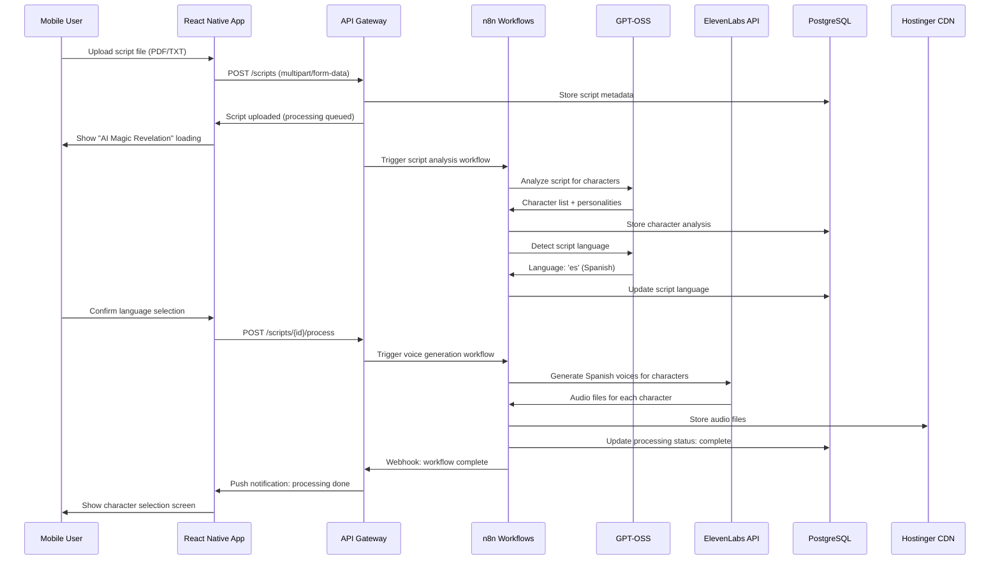
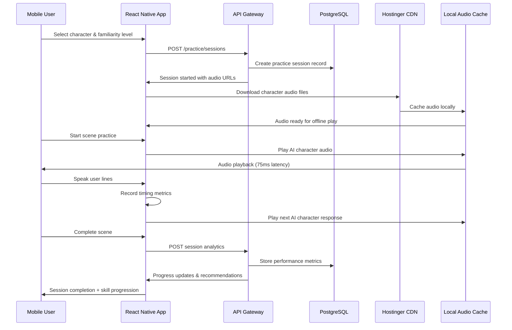
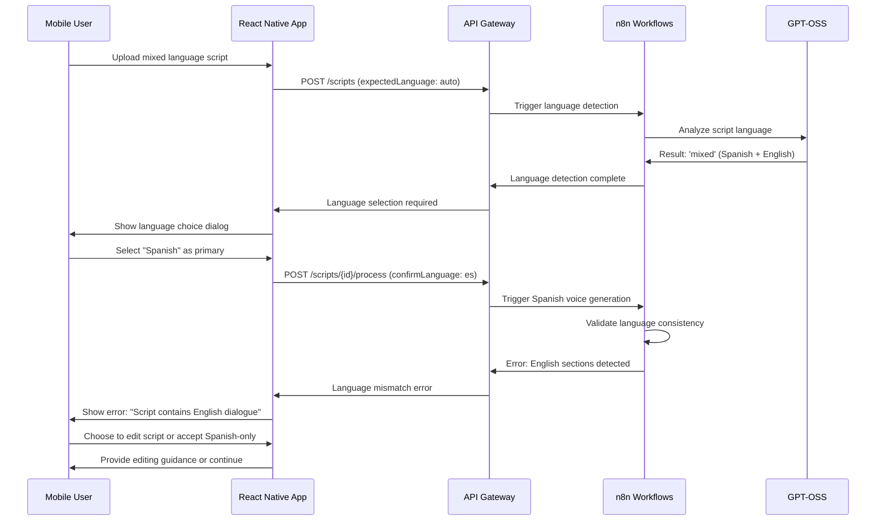

# Core Workflows

The following sequence diagrams illustrate key system workflows combining frontend user interactions, backend API coordination, and AI processing pipelines:

## Script Upload and AI Processing Workflow

## Practice Session Workflow

## Language Error Handling Workflow

