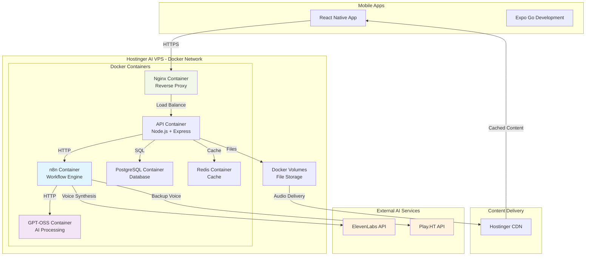

# High Level Architecture

## Technical Summary

ScripTeam implements a **hybrid cloud architecture** optimized for AI-powered voice practice applications. The system combines **self-hosted GPT-OSS intelligence** running on Hostinger AI VPS with **n8n workflow orchestration** for rapid development, while leveraging **external voice synthesis APIs** for premium audio quality. The **React Native + Expo** frontend provides cross-platform mobile access with offline capabilities, supported by a **Node.js backend** that coordinates AI processing pipelines and real-time practice sessions.

The architecture achieves PRD goals through **pre-processing AI workflows** that analyze scripts, generate character voices, and create visual assets before practice sessions begin, ensuring responsive user experience while controlling variable AI costs. **PostgreSQL + Redis** provide robust data persistence and caching, while the **monorepo structure** enables shared TypeScript interfaces and rapid iteration across the full stack.

## Platform and Infrastructure Choice

**Selected Platform:** Hostinger AI VPS + n8n Workflow Orchestration

**Key Services:**
- **Hostinger AI VPS** (12 cores, 32GB RAM) - Docker container host with Docker Compose orchestration
- **Containerized n8n** - Visual AI workflow orchestration and GPT-OSS integration in isolated container
- **Containerized GPT-OSS** - Self-hosted AI processing with dedicated resource allocation
- **ElevenLabs/Play.HT APIs** - External voice synthesis services
- **Docker Network** - Internal service communication with nginx reverse proxy
- **Hostinger CDN** - Global content delivery for audio files and static assets

**Deployment Host and Regions:**
- **Primary:** Hostinger EU data centers (GDPR compliance)
- **CDN:** Global edge locations for optimal mobile app performance

**Rationale:** This containerized platform choice balances rapid development (Docker development parity), cost efficiency ($65/month vs $2000+ for AWS GPU), operational reliability (container isolation), and technical capabilities while maintaining clear scaling path through container orchestration as the business grows.

## Repository Structure

**Structure:** Monorepo with workspaces for shared code and AI workflow definitions

**Monorepo Tool:** npm workspaces with Docker Compose for service orchestration

**Package Organization:**
- Frontend and backend applications as separate workspaces with individual Dockerfiles
- Shared TypeScript interfaces for data models and API contracts
- n8n workflow definitions version-controlled and mounted into containers
- Docker Compose configuration for service orchestration
- Common utilities and configuration shared across all packages

## High Level Architecture Diagram

## Architectural Patterns

- **Event-Driven AI Processing:** n8n workflows orchestrate complex AI pipelines with automatic retry and error handling - _Rationale:_ Visual workflow management reduces development complexity while providing robust error handling for AI service integration

- **Hybrid AI Architecture:** Self-hosted analysis combined with external voice synthesis APIs - _Rationale:_ Balances competitive advantages (proprietary script analysis) with practical constraints (voice quality and development speed)

- **Pre-Processing Pipeline Pattern:** All AI-intensive operations completed before user practice sessions - _Rationale:_ Ensures responsive UX while controlling variable AI costs through batch processing

- **Component-Based Mobile UI:** React Native components with progressive script familiarity levels - _Rationale:_ Enables sophisticated practice experience with shared codebase across iOS and Android platforms

- **Containerized Microservices:** Docker containers for each service with nginx reverse proxy - _Rationale:_ Provides service isolation, resource management, and reliable deployments while maintaining monolithic simplicity

- **API Gateway Pattern:** Single Node.js endpoint orchestrating n8n workflows and external services - _Rationale:_ Simplifies mobile app integration while providing centralized authentication and rate limiting

- **Caching-First Data Strategy:** Multi-layer caching from Redis to CDN for AI-generated content - _Rationale:_ Minimizes API costs and latency while supporting offline practice capability
