# ScripTeam Brownfield Architecture Document

## Introduction

This document captures the CURRENT STATE of the ScripTeam AI-powered acting practice platform, including technical debt, workarounds, and real-world patterns post ADR-002 architectural pivot. It serves as a comprehensive reference for AI agents and custom orchestrators working on the codebase.

### Document Scope

**Focused on AI Infrastructure & Voice Synthesis Architecture** - Detailed coverage of:
- AI infrastructure and n8n workflow orchestration
- Voice synthesis pipeline and character voice generation
- Custom agent architecture for solopreneur development
- Real-time voice interaction systems
- Current "as-built" reality including pivot technical debt

### Change Log

| Date | Version | Description | Author |
|------|---------|-------------|---------|
| 2025-09-26 | 1.0 | Initial brownfield analysis post ADR-002 pivot | Winston (Architect) |

## Quick Reference - Critical AI Infrastructure Files

### Core AI Pipeline Files

- **Main API Entry**: `apps/api/src/index.ts` - Express server with AI processing routes
- **Script Processing**: `apps/api/src/services/pdfExtractorService.ts` - PDF text extraction with AI analysis
- **Voice Synthesis**: `apps/api/src/routes/scripts.ts` - ElevenLabs integration endpoint
- **AI Character Detection**: Referenced in Story 2.2 but NOT YET IMPLEMENTED
- **n8n Workflows**: `n8n/workflows/` - AI orchestration workflows (directory exists, content TBD)
- **Custom Agents**: `.bmad-core/agents/` - BMad custom agents for development orchestration

### Frontend AI Integration

- **Script Upload**: `apps/web/src/components/ScriptUpload.tsx` - AI processing UI with progress indicators
- **Character Selection**: `apps/web/src/components/CharacterSelection.tsx` - AI-detected character display
- **API Client**: `apps/web/src/lib/api.ts` - Frontend to AI backend communication

### Configuration & Environment

- **Environment Config**: `apps/api/src/.env.example` - AI service API keys and endpoints
- **Docker AI Services**: `docker-compose.yml` - PostgreSQL, Redis for AI result caching
- **Shared Types**: `packages/shared/src/types/` - AI processing types and interfaces

## High Level Architecture

### Technical Summary - Post ADR-002 Pivot Reality

**Current State**: React Web PoC with Express.js AI backend, designed for Flutter migration
**Architecture Pattern**: Event-driven AI processing with caching layer
**AI Strategy**: Multi-provider voice synthesis with local processing capabilities

### Actual Tech Stack (From Analysis)

| Category | Technology | Version | Implementation Status | AI Integration Notes |
|----------|------------|---------|----------------------|-------------------|
| **Frontend** | React + Vite + TypeScript | 18.3.1 + 5.4.19 + 5.8.3 | ✅ Production Ready | ShadCN/UI components, AI processing progress UI |
| **Backend** | Express.js + TypeScript | 4.18.2 + 5.1.6 | ✅ Production Ready | AI service integration endpoints, rate limiting |
| **Database** | PostgreSQL | 15 (Docker) | ✅ With Fallback | In-memory fallback for AI results when PostgreSQL unavailable |
| **Cache** | Redis | 7 (Docker) | ✅ Configured | AI voice caching, session management |
| **Voice Synthesis** | ElevenLabs Flash v2.5 | v1 API | 🔄 In Progress | Primary provider, 75ms latency target |
| **Voice Fallback** | Play.HT Play 3.0 Mini | Latest API | 📋 Planned | Secondary provider, 143ms latency |
| **AI Orchestration** | n8n | Docker | 🔧 Infrastructure Ready | Workflow directory exists, content TBD |
| **File Processing** | pdf-parse + multer | 1.1.1 + 1.4.5 | ✅ Production Ready | Script text extraction, 10MB limit |
| **Custom Agents** | BMad Framework | Custom | ✅ Active | 10 specialized agents for development |

### Repository Structure Reality Check

- **Type**: Monorepo with npm workspaces
- **Package Manager**: npm (not yarn/pnpm)
- **Notable**: Post-pivot structure mixing web-first with mobile-preparation patterns

## Source Tree and AI Module Organization

### Project Structure (Current Reality)

```text
scripteam-poc/
├── apps/
│   ├── web/                    # React Web PoC (Phase 1)
│   │   ├── src/components/     # AI UI components
│   │   │   ├── ScriptUpload.tsx        # AI processing progress UI
│   │   │   └── CharacterSelection.tsx  # AI character detection display
│   │   ├── src/lib/api.ts     # AI backend communication
│   │   └── package.json       # React + AI UI dependencies
│   └── api/                    # Express.js AI Backend
│       ├── src/
│       │   ├── routes/scripts.ts       # AI processing endpoints
│       │   ├── services/
│       │   │   ├── pdfExtractorService.ts  # AI text extraction
│       │   │   └── database.ts             # AI result persistence
│       │   ├── middleware/rateLimiter.ts   # AI API protection
│       │   └── index.ts               # AI service orchestration
│       └── __tests__/          # AI endpoint testing
├── packages/shared/            # AI types and interfaces
├── n8n/
│   └── workflows/              # AI orchestration workflows (TBD)
├── .bmad-core/                 # Custom development agents
│   ├── agents/                 # 10 specialized AI development agents
│   ├── tasks/                  # Agent task definitions
│   └── workflows/              # Development workflow automation
├── docs/
│   ├── architecture/           # System design documentation
│   ├── prd/                    # Epic and story definitions
│   └── stories/                # AI feature requirements
└── docker-compose.yml          # AI infrastructure orchestration
```

### Key AI Modules and Their Current Purpose

#### **Core AI Processing Pipeline**
- **PDF Extraction**: `apps/api/src/services/pdfExtractorService.ts` - Script text extraction with format detection
- **Script Analysis**: Referenced in Story 2.2 - CHARACTER DETECTION NOT YET IMPLEMENTED
- **Voice Synthesis**: `apps/api/src/routes/scripts.ts` - ElevenLabs API integration endpoint
- **Character Management**: `apps/web/src/components/CharacterSelection.tsx` - UI for AI-detected characters

#### **AI Infrastructure Services**
- **Database Layer**: `apps/api/src/services/database.ts` - PostgreSQL with in-memory fallback for AI results
- **Caching Layer**: Redis configuration in `docker-compose.yml` - Voice file and AI response caching
- **Rate Limiting**: `apps/api/src/middleware/rateLimiter.ts` - AI API call protection (5 uploads/min)
- **File Storage**: Local file system with UUID naming for AI-generated voice files

#### **Custom Agent Orchestration (BMad Framework)**
- **Agent Definitions**: `.bmad-core/agents/` - 10 specialized development agents
  - `analyst.md` - Market research and brainstorming
  - `architect.md` - System design and technical planning
  - `dev.md` - Development implementation
  - `pm.md` - Project management and planning
  - `po.md` - Product ownership and story management
  - `qa.md` - Quality assurance and testing
  - `sm.md` - Scrum master and process management
  - `ux-expert.md` - User experience and design
  - `bmad-orchestrator.md` - Agent coordination and workflow management
  - `bmad-master.md` - Master coordination agent

## AI Infrastructure Deep Dive

### Voice Synthesis Architecture (Current Implementation)

#### **Primary Voice Provider: ElevenLabs**
```typescript
// Current Implementation Pattern (apps/api/src/routes/scripts.ts)
interface VoiceSynthesisFlow {
  trigger: 'POST /api/scripts' // Script upload
  processing: [
    'text_extraction',    // PDF → text via pdf-parse
    'character_detection', // MISSING: AI character identification
    'voice_generation',   // MISSING: ElevenLabs integration
    'audio_caching'       // MISSING: Redis/local storage
  ]
  responseTime: '< 3 seconds target' // Current: PDF processing only
}
```

#### **Technical Debt from ADR-002 Pivot**
- ✅ **PDF Processing**: Complete implementation
- ❌ **Character Detection**: Story 2.2 planned but not implemented
- ❌ **Voice Synthesis**: ElevenLabs integration endpoint exists but no actual integration
- ❌ **Audio Caching**: Redis configured but no voice file caching implemented
- ❌ **Fallback Provider**: Play.HT integration completely missing

### n8n Workflow Orchestration (Infrastructure Ready)

#### **Current State**
```bash
# n8n directory structure
n8n/
└── workflows/              # Empty - workflows not yet defined
```

#### **Planned AI Workflow Architecture**
Based on Epic requirements and solopreneur development patterns:

```yaml
# Proposed n8n AI Orchestration Workflows
workflows:
  script-processing:
    trigger: "webhook from Express.js API"
    steps:
      - pdf_text_extraction
      - character_detection_ai
      - voice_profile_generation
      - elevenlabs_synthesis
      - audio_file_caching
      - response_webhook

  character-voice-matching:
    trigger: "character detection complete"
    steps:
      - personality_analysis
      - voice_parameter_mapping
      - elevenlabs_voice_selection
      - test_audio_generation

  voice-consistency-check:
    trigger: "multi-scene processing"
    steps:
      - existing_voice_lookup
      - consistency_validation
      - voice_parameter_adjustment
```

### Custom Agent Architecture for Solopreneur Development

#### **BMad Agent Orchestration Pattern**


#### **Agent Specialization for AI Development**
- **Architect Agent (Winston)**: AI system design, voice pipeline architecture
- **Development Agent (James)**: ElevenLabs integration, n8n workflow implementation
- **Product Owner (Sarah)**: AI feature story management, voice synthesis requirements
- **QA Agent (Quinn)**: Voice quality testing, AI endpoint validation
- **Analyst Agent (Mary)**: Voice synthesis market research, provider comparison

## Data Models and AI Processing APIs

### AI Processing Data Models

#### **Current Script Processing Schema**
```typescript
// Actual implementation: packages/shared/src/types/script.ts
interface Script {
  id: string;
  userId: string;
  title: string;
  originalText: string;           // PDF extracted text
  detectedLanguage: 'es' | 'en' | 'mixed' | 'unknown';
  primaryLanguage: 'es' | 'en';
  processingStatus: ProcessingStatus;  // 'uploading' | 'analyzing' | 'complete'
  fileMetadata: FileMetadata;
  uploadedAt: Date;
  // MISSING: characters array - not yet implemented
  // MISSING: scenes array - not yet implemented
  // MISSING: voiceProfiles array - not yet implemented
}
```

#### **Planned AI Enhancement Models (Not Yet Implemented)**
```typescript
// Proposed for Story 2.2-2.3 implementation
interface Character {
  id: string;
  scriptId: string;
  name: string;
  personality: PersonalityTraits;    // AI-detected traits
  voiceProfile: VoiceProfile;        // ElevenLabs voice configuration
  lineCount: number;                 // Speaking frequency
  emotionalRange: EmotionalContext[]; // Scene-based emotional states
}

interface VoiceProfile {
  providerId: 'elevenlabs' | 'playht';
  voiceId: string;
  parameters: VoiceParameters;
  generatedSamples: AudioFile[];
  consistency: ConsistencyMetrics;
}
```

### AI API Specifications (Current vs Planned)

#### **Current API Implementation**
```typescript
// POST /api/scripts - Script Upload and Processing
// Implementation: apps/api/src/routes/scripts.ts
{
  endpoint: "/api/scripts",
  method: "POST",
  contentType: "multipart/form-data",
  body: {
    file: "PDF or text file (max 10MB)",
    title?: "string (optional)"
  },
  response: {
    id: "uuid",
    processingStatus: "uploading" | "analyzing" | "complete",
    originalText?: "extracted text",
    // MISSING: characters array
    // MISSING: voice generation status
  }
}
```

#### **Planned AI Enhancement APIs (Story 2.2-2.3)**
```typescript
// Planned Voice Synthesis Endpoints
{
  // Character Detection
  "GET /api/scripts/:id/characters": "AI-detected character list",

  // Voice Generation
  "POST /api/scripts/:id/voices": "Generate character voices",

  // Voice Preview
  "GET /api/voices/:characterId/preview": "Voice sample audio",

  // Scene Practice
  "GET /api/scripts/:id/scenes/:sceneId/audio": "Pre-generated scene audio"
}
```

## Technical Debt and AI Implementation Gaps

### Critical Technical Debt from ADR-002 Pivot

#### **1. Character Detection AI - COMPLETELY MISSING**
- **Story**: 2.2 Script Analysis and Character Detection
- **Status**: Planned but zero implementation
- **Impact**: Voice synthesis cannot proceed without character identification
- **Files Affected**: None yet created
- **Required**: AI service integration for character name detection from scripts

#### **2. ElevenLabs Voice Synthesis - ENDPOINT ONLY**
- **Current State**: API route exists but no actual ElevenLabs integration
- **Missing Components**:
  - ElevenLabs API client implementation
  - Voice parameter mapping from character traits
  - Audio file generation and storage
  - Voice consistency management
- **Technical Debt**: Mock processing in frontend but no backend implementation

#### **3. n8n AI Orchestration - INFRASTRUCTURE ONLY**
- **Current State**: Directory structure exists, Docker not configured
- **Missing Components**:
  - n8n service in docker-compose.yml
  - AI workflow definitions
  - Webhook integration with Express.js API
  - Custom nodes for voice synthesis
- **Impact**: No AI workflow automation, all processing must be synchronous

#### **4. Voice Caching and Storage - REDIS CONFIGURED BUT UNUSED**
- **Current State**: Redis container running but no voice file caching
- **Missing Components**:
  - Voice file storage strategy
  - Cache key management for character voices
  - Audio file compression and optimization
  - Offline voice playback support

### AI Infrastructure Workarounds and Gotchas

#### **Environment Variables for AI Services**
```bash
# Required but not yet used (apps/api/src/.env.example)
ELEVENLABS_API_KEY=your_elevenlabs_key_here          # Not yet implemented
PLAYHT_API_KEY=your_playht_key_here                  # Not yet implemented
ELEVENLABS_BASE_URL=https://api.elevenlabs.io/v1    # Not yet implemented
VOICE_CACHE_EXPIRY=86400                             # Not yet implemented
```

#### **Database Fallback Pattern for AI Results**
```typescript
// Current implementation: apps/api/src/services/database.ts
// CRITICAL: Falls back to in-memory storage when PostgreSQL unavailable
// This means AI processing results are lost on server restart
if (!databaseConnectionSuccessful) {
  console.warn('Using in-memory storage - AI results will not persist');
  // All voice profiles, character data lost on restart
}
```

#### **Rate Limiting for AI API Calls**
```typescript
// Current implementation: apps/api/src/middleware/rateLimiter.ts
const uploadRateLimit = {
  windowMs: 60 * 1000,      // 1 minute
  max: 5,                   // 5 uploads per minute
  // This may be too restrictive for voice synthesis testing
  // Each character voice generation counts as separate API call
}
```

## Integration Points and AI Service Dependencies

### External AI Services (Planned Integration)

| Service | Purpose | Integration Type | Current Status | Cost Implications |
|---------|---------|------------------|----------------|-------------------|
| **ElevenLabs Flash v2.5** | Primary voice synthesis | REST API | 📋 Endpoint Ready | ~$0.18/1K chars, 75ms latency |
| **Play.HT Play 3.0 Mini** | Fallback voice synthesis | REST API | ❌ Not Started | ~$0.095/1K chars, 143ms latency |
| **OpenAI GPT** | Character personality analysis | REST API | ❌ Not Started | Variable, depends on prompt complexity |
| **n8n** | AI workflow orchestration | Webhook + API | 🔧 Infrastructure Only | Self-hosted, free |

### Internal AI Integration Points

#### **Frontend ↔ AI Backend Communication**
```typescript
// Current pattern: apps/web/src/lib/api.ts
const aiProcessingFlow = {
  upload: 'POST /api/scripts',           // ✅ Working
  poll: 'GET /api/scripts/:id/status',  // ✅ Working
  characters: 'GET /api/scripts/:id/characters', // ❌ Not implemented
  voices: 'POST /api/scripts/:id/voices',        // ❌ Not implemented
  practice: 'GET /api/scripts/:id/practice'      // ❌ Not implemented
}
```

#### **AI Service → Cache → Frontend Flow**

```mermaid
sequenceDiagram
    participant F as Frontend
    participant A as API
    participant E as ElevenLabs
    participant R as Redis
    participant D as Database

    F->>A: Upload Script
    A->>D: Store Script
    A->>A: Extract Text (✅ Working)
    A->>A: Detect Characters (❌ Missing)
    A->>E: Generate Voices (❌ Missing)
    E->>A: Voice Audio Files
    A->>R: Cache Voice Files (❌ Missing)
    A->>F: Processing Complete
```


## Development and Deployment

### Local Development Setup (Current Reality)

#### **Working Setup Steps**
```bash
# 1. Clone and dependencies
git clone [repository]
cd scripteam-poc
npm install

# 2. Environment setup
cp apps/api/src/.env.example apps/api/src/.env
# Edit .env with actual AI service API keys (when implemented)

# 3. Start full stack with Docker
docker-compose up -d    # PostgreSQL + Redis + API + Web

# 4. Verify AI infrastructure
curl http://localhost:3001/health                    # API health
curl http://localhost:3001/api/scripts               # AI endpoints
# Frontend: http://localhost:5173
```

#### **AI Development Gotchas**
- **Database Connection**: API gracefully falls back to in-memory if PostgreSQL unavailable
- **CORS Configuration**: Hardcoded for localhost:5173 (Vite dev server)
- **File Upload Limits**: 10MB limit enforced in both frontend and backend
- **Rate Limiting**: 5 uploads per minute may be too restrictive for AI testing

### AI Service Integration Development

#### **ElevenLabs Integration Development Pattern**
```typescript
// Recommended implementation approach
// File: apps/api/src/services/voiceSynthesisService.ts (not yet created)

class VoiceSynthesisService {
  private elevenLabsClient: ElevenLabsClient;
  private playHtClient: PlayHtClient;
  private cacheService: VoiceCacheService;

  async generateCharacterVoice(character: Character): Promise<VoiceProfile> {
    // 1. Check cache first
    // 2. Map character traits to voice parameters
    // 3. Call ElevenLabs API with fallback to Play.HT
    // 4. Store in Redis cache
    // 5. Return voice profile with audio URLs
  }
}
```

#### **n8n Workflow Development Process**
```bash
# 1. Add n8n to docker-compose.yml
# 2. Create webhook endpoints in Express.js
# 3. Design AI workflows in n8n web interface
# 4. Export workflows to n8n/workflows/
# 5. Version control workflow definitions
```

## Testing Reality for AI Components

### Current Test Coverage for AI Pipeline

#### **Backend AI Tests**
```bash
# Test location: apps/api/src/__tests__/
npm run test                    # Jest + Supertest
# Current coverage: File upload and PDF processing only
# Missing: Character detection, voice synthesis, caching
```

#### **Frontend AI Component Tests**
```bash
# Test location: apps/web/src/__tests__/ (exists but minimal)
npm run test                    # Jest + React Testing Library
# Current coverage: ScriptUpload component UI only
# Missing: Character selection, voice preview, practice session
```

#### **AI Service Integration Testing Strategy**
```typescript
// Recommended test patterns for AI services
describe('Voice Synthesis Service', () => {
  it('should generate consistent voices for same character');
  it('should fallback to Play.HT when ElevenLabs fails');
  it('should cache voice files in Redis');
  it('should handle rate limits gracefully');
});

describe('Character Detection', () => {
  it('should identify characters in standard script formats');
  it('should handle Spanish and English scripts');
  it('should extract personality traits from dialogue');
});
```

## AI Enhancement Implementation Roadmap

### Immediate AI Infrastructure Priorities (Next Sprint)

#### **1. Character Detection Implementation (Story 2.2)**
```typescript
// Required files to create:
apps/api/src/services/
├── characterDetectionService.ts    # AI character identification
├── scriptAnalysisService.ts        # Text parsing and analysis
└── openaiClient.ts                 # GPT integration for personality analysis
```

#### **2. ElevenLabs Voice Synthesis (Story 2.3)**
```typescript
// Required files to create:
apps/api/src/services/
├── voiceSynthesisService.ts        # Primary voice generation
├── elevenLabsClient.ts             # ElevenLabs API integration
├── playHtClient.ts                 # Fallback provider
└── voiceCacheService.ts            # Redis voice file caching
```

#### **3. n8n AI Workflow Orchestration**
```yaml
# Required n8n workflow files:
n8n/workflows/
├── script-processing-pipeline.json      # Main AI processing workflow
├── character-voice-generation.json      # Voice synthesis workflow
├── voice-consistency-manager.json       # Multi-scene voice consistency
└── webhook-integration.json             # Express.js ↔ n8n communication
```

### AI Infrastructure Enhancement Timeline

#### **Week 1-2: Character Detection Foundation**
- ✅ OpenAI GPT integration for character identification
- ✅ Script parsing service for dialogue extraction
- ✅ Character personality trait analysis
- ✅ Database schema updates for Character model

#### **Week 3-4: Voice Synthesis Implementation**
- ✅ ElevenLabs API client and authentication
- ✅ Character trait → voice parameter mapping
- ✅ Play.HT fallback implementation
- ✅ Redis voice file caching system

#### **Week 5-6: n8n Workflow Orchestration**
- ✅ n8n service integration in Docker
- ✅ AI processing workflow design and implementation
- ✅ Webhook integration between Express.js and n8n
- ✅ Voice consistency management workflows

#### **Week 7-8: Real-time Practice Session Engine**
- ✅ Scene-based voice playback system
- ✅ Real-time cue detection and response
- ✅ Session state management with Redis
- ✅ Performance optimization for smooth playback

## Custom Agent Development Patterns

### BMad Agent Orchestration for AI Development

#### **Agent Workflow for AI Feature Implementation**


#### **Recommended Agent Usage for AI Development**

**For Voice Synthesis Implementation:**
1. **Architect (Winston)**: Design voice synthesis pipeline architecture
2. **Developer (James)**: Implement ElevenLabs/Play.HT integration
3. **QA (Quinn)**: Create voice quality testing framework
4. **Product Owner (Sarah)**: Update Story 2.3 with implementation details

**For Character Detection Development:**
1. **Analyst (Mary)**: Research character detection algorithms and approaches
2. **Architect (Winston)**: Design character analysis service architecture
3. **Developer (James)**: Implement OpenAI GPT integration for character identification
4. **QA (Quinn)**: Create character detection accuracy testing

**For n8n Workflow Orchestration:**
1. **Architect (Winston)**: Design AI workflow orchestration patterns
2. **Developer (James)**: Implement n8n service integration and workflows
3. **SM (Bob)**: Manage n8n workflow deployment and monitoring
4. **PO (Sarah)**: Define AI workflow requirements and acceptance criteria

## Appendix - AI Development Commands and Scripts

### Frequently Used AI Development Commands

```bash
# Full stack development with AI services
npm run dev                     # Start web frontend (Vite)
npm run dev:api                 # Start AI backend (Express + tsx watch)
docker-compose up -d            # Start PostgreSQL + Redis for AI caching

# AI service testing and validation
curl -X POST localhost:3001/api/scripts \
  -F "file=@test-script.pdf"    # Test script upload and processing

# AI infrastructure monitoring
docker-compose logs api         # Monitor AI backend logs
docker-compose logs postgres    # Monitor database for AI results
docker-compose logs redis       # Monitor cache for voice files

# AI development workflow with BMad agents
# (Use BMad Orchestrator commands)
*agent architect               # Switch to architecture planning
*agent dev                     # Switch to implementation
*agent qa                      # Switch to AI testing
```

### AI Infrastructure Troubleshooting

#### **Common AI Development Issues**
- **ElevenLabs API Rate Limits**: Check rate limiting middleware configuration
- **Voice Cache Misses**: Verify Redis connection and key naming patterns
- **Character Detection Failures**: Validate OpenAI API configuration and prompts
- **n8n Workflow Errors**: Check webhook endpoint configuration and payload formats

#### **AI Service Health Checks**
```bash
# API health and AI service status
curl http://localhost:3001/health

# Database connection for AI results
docker-compose exec postgres psql -U postgres -d scripteam -c "\dt"

# Redis cache for voice files
docker-compose exec redis redis-cli ping
docker-compose exec redis redis-cli keys "*voice*"

# n8n workflow status (when implemented)
curl http://localhost:5678/healthz
```

#### **AI Performance Monitoring**
- **Voice Generation Latency**: Target <3 seconds for ElevenLabs, <5 seconds for Play.HT
- **Character Detection Accuracy**: Target >90% for standard script formats
- **Cache Hit Ratio**: Target >80% for voice file cache efficiency
- **API Rate Limiting**: Monitor for 429 responses from AI service providers

---

**Document Status**: Comprehensive brownfield analysis complete
**Focus Areas**: AI infrastructure, voice synthesis, n8n workflows, custom agent orchestration
**Target Audience**: Solopreneur development with AI agent assistance
**Next Steps**: Implement Character Detection (Story 2.2) → Voice Synthesis (Story 2.3) → n8n Orchestration