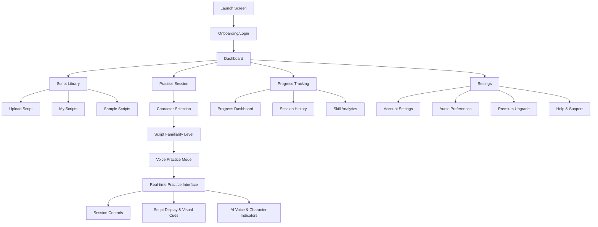
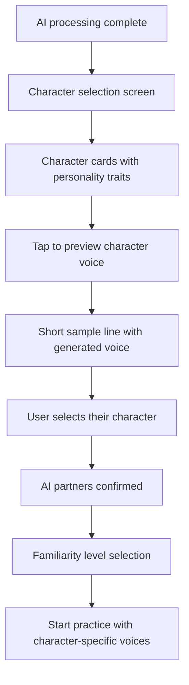
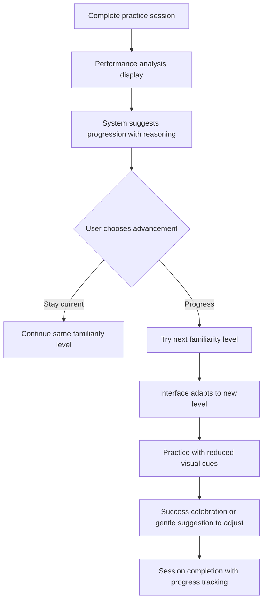

# scripteam-poc UI/UX Specification

## Introduction

This document defines the user experience goals, information architecture, user flows, and visual design specifications for scripteam-poc's user interface. It serves as the foundation for visual design and frontend development, ensuring a cohesive and user-centered experience.

## Change Log
| Date | Version | Description | Author |
|------|---------|-------------|--------|
| 2025-09-19 | v1.0 | Initial UI/UX specification creation | Sally (UX Expert) |

## Overall UX Goals & Principles

### Target User Personas

**Drama Student (Primary):** Students aged 16-28 in acting programs who need affordable, accessible practice tools.
- **Device Context:** Primarily mobile-first users (iPhone 12+, Samsung Galaxy A-series), often practicing in dorms/shared spaces
- **Interaction Patterns:** Prefer touch-based navigation, expect app-like gestures, comfortable with voice recording but may need privacy controls
- **Visual Accessibility:** Mix of visual learners and those with mild dyslexia (common in creative fields) - require strong contrast, readable fonts
- **Budget Constraints:** €200-500/month disposable income, price-sensitive to subscription costs, expect clear value demonstration
- **Practice Environment:** Shared living spaces requiring headphone compatibility, potentially inconsistent WiFi, limited storage space

**Early-Career Actor (Secondary):** Professional actors aged 25-35 with 1-5 years experience who need efficient audition preparation tools.
- **Device Context:** Premium mobile devices, may use tablets for script review, expect professional-grade audio quality
- **Workflow Integration:** Need seamless file management for multiple concurrent auditions, expect cloud sync across devices
- **Time Sensitivity:** Practice sessions often rushed between work shifts, require quick session resume/pause functionality
- **Professional Standards:** Expect industry-standard script formatting, precise timing controls, high-quality voice synthesis

### Usability Goals

**Immediate Practice Access (2-minute onboarding):**
- **Design Requirements:** Single-page script upload with drag-drop support, automatic character detection with visual confirmation, one-tap practice initiation
- **Success Metrics:** 90% of users complete first practice session within 2 minutes, <5% abandonment during initial upload process
- **Error Handling:** Clear upload progress indicators, graceful degradation for unsupported file types, offline script caching

**Skill Progression Visibility (3-month learning curve):**
- **Visual Progress System:** Progress rings/bars showing completion percentage per difficulty level, achievement badges for milestones
- **Adaptive UI Elements:** Script text gradually reduces opacity as users advance, dynamic hint system based on performance
- **Performance Analytics:** Session duration tracking, line accuracy visualization, confidence scoring through voice analysis
- **Motivational Design:** Streak counters, weekly goals, social sharing of achievements (privacy-controlled)

**Mobile-First Efficiency:**
- **Touch Targets:** Minimum 44px tap targets for practice controls, swipe gestures for script navigation
- **One-Handed Operation:** Critical controls within thumb reach zones, voice activation for hands-free practice
- **Battery Optimization:** Background processing limits, efficient audio streaming, low-power mode compatibility
- **Data Conservation:** Offline script caching, compressed audio streams, progressive image loading

**Budget-Conscious Value Demonstration:**
- **Freemium UX Strategy:** Full practice session access with 2 AI voices, limited script uploads, progress tracking
- **Premium Upgrade Flow:** Clear feature comparison table, trial periods, graduated pricing based on usage
- **Value Visualization:** Cost comparison with private coaching (€40-80/hour), progress tracking showing skill development ROI

### Design Principles

**1. Clarity over cleverness**
- **Typography:**
  - **Script Text:** Courier New, Courier Prime, or similar monospace typewriter fonts for authentic screenplay presentation
  - **UI Elements:** Clean sans-serif (Inter, SF Pro) for modern app interface contrast
  - **Hierarchy:** Script content maintains traditional screenplay formatting (12pt Courier equivalent), UI text minimum 16px for mobile readability
- **Screenplay Authenticity:** Monospace fonts preserve proper character/dialogue spacing, industry-standard formatting that actors recognize
- **Dual Font Strategy:** Typewriter fonts for script content create immersive experience, while sans-serif UI ensures modern usability
- **Information Hierarchy:** Clear H1-H6 progression, consistent spacing scale (8px base unit), maximum 3 levels of nesting
- **Color Strategy:** High-contrast color palette (WCAG AAA compliance), functional color coding (red=recording, green=AI speaking)
- **Iconography:** Universally recognized symbols, text labels for complex actions, consistent stroke weights

**2. Progressive disclosure**
- **Adaptive Interface:** Beginner mode shows full script + controls, advanced mode minimizes distractions
- **Contextual Menus:** Feature discovery through guided tours, just-in-time feature introduction
- **Settings Architecture:** Basic/Advanced settings tabs, sensible defaults with optional customization
- **Content Prioritization:** Primary actions always visible, secondary features in overflow menus

**3. Immediate feedback**
- **Visual Feedback System:** Real-time waveform display during recording, typing indicators when AI is processing
- **Audio Cues:** Distinct notification sounds for turn transitions, success confirmations, error alerts
- **Haptic Patterns:** Custom vibration patterns for different interaction types (iOS), gentle feedback for Android
- **Loading States:** Skeleton screens for content loading, progress indicators for AI processing, micro-animations for state changes

**4. Accessible by default**
- **Voice Control:** Complete app navigation via voice commands, speech recognition for script navigation
- **Screen Reader Support:** Semantic HTML structure, comprehensive ARIA labels, logical tab order
- **Motor Accessibility:** Large touch targets, gesture alternatives, voice activation options
- **Cognitive Accessibility:** Simple language in UI copy, consistent navigation patterns, clear error messaging
- **Hearing Accessibility:** Visual alternatives for all audio cues, adjustable audio levels, subtitle options

**5. Performance-first**
- **Real-time Constraints:** <2 second AI response latency, <500ms UI response time, 60fps animations
- **Memory Management:** Efficient audio buffer management, script content lazy loading, image optimization
- **Network Optimization:** Request batching, intelligent caching strategies, graceful offline degradation
- **Battery Efficiency:** Background processing limits, CPU-intensive task scheduling, display brightness optimization

## Information Architecture (IA)

### Site Map / Screen Inventory



### Navigation Structure

**Primary Navigation:** Bottom tab bar with 4 core sections: Scripts, Practice, Progress, Profile
- Mobile-optimized for thumb navigation
- Always visible during app usage (except during active voice practice)
- Visual indicators for premium features and character voice differentiation

**Secondary Navigation:** Contextual navigation within each primary section
- Floating action buttons for primary actions (Upload Script, Start Practice)
- Character voice selection prominently featured in practice setup
- Voice-activated navigation during practice sessions

**Breadcrumb Strategy:** Script familiarity-focused orientation
- Current script name and familiarity level always visible during practice
- Session progress indicator (Scene 2 of 5, "Know some lines" mode)
- Quick progression level adjustment without losing session progress

### Real-Time Practice Interface Design

**Speaking Order Visual Indicators:**
- **Character Avatar System:** Small character avatars showing speaking order (Character A → You → Character B → You)
- **Progress Dots:** Linear progression showing current position in dialogue sequence
- **Character Name Highlighting:** Current speaker's name glows/pulses, next speaker dims in

**Turn Anticipation System:**
- **Line Context Display:** Previous 2-3 lines visible above current line in reduced opacity
- **Cue Pickup Highlighting:** Specific words leading into user's line are emphasized
- **Pre-Turn Countdown:** Subtle 3-2-1 visual countdown as AI character finishes speaking

**Script Familiarity Progression:**
- **"First read":** Full script visible + all character indicators + timing cues + line previews
- **"Know some lines":** Partial line hiding for familiar sections + reduced visual aids + selective cue prompts
- **"Know most lines":** Most lines hidden + minimal indicators + focus on timing and flow
- **"Know all my lines":** Complete "blackout mode" + audio-only cues + professional performance simulation

**Conversation Flow Animations:**
- **Real-time Waveforms:** Show AI voice patterns and user recording patterns
- **Turn Transitions:** Smooth animated handoff between speakers (conversation baton effect)
- **Timing Feedback:** Green pulses for good timing, gentle orange for rushed/slow pickup
- **Progress Celebration:** Micro-animations for completed scenes and successful interactions

## User Flows

### Script Upload & AI Magic Revelation Flow

**User Goal:** Upload a new script and witness AI transformation into interactive practice session

**Entry Points:**
- Dashboard "Upload Script" button
- Empty state in Script Library
- Onboarding completion

**Success Criteria:** User understands and appreciates the AI processing value before starting practice

#### Flow Diagram
```mermaid
graph TD
    A[User uploads script] --> B[Processing begins with engaging loader]
    B --> C[Step 1: 'Reading your script...']
    C --> D[Step 2: 'Identifying characters: HAMLET, OPHELIA, CLAUDIUS']
    D --> E[Step 3: 'Analyzing character relationships...']
    E --> F[Step 4: 'Generating voice for CLAUDIUS (wise, authoritative)']
    F --> G[Step 5: 'Generating voice for OPHELIA (young, emotional)']
    G --> H[Step 6: 'Preparing your scene partners...']
    H --> I[Reveal: Full character cast with voice previews]
    I --> J[User selects their character with excitement]
    J --> K[Choose familiarity level]
    K --> L[Start practice with generated AI cast]
```

#### Magic Revelation Loading Experience

**Progressive Disclosure During Processing (90-120 seconds):**
- **Phase 1 (0-15s):** "Reading your script..." with animated page turning effect
- **Phase 2 (15-30s):** "Found 4 characters: ROMEO, JULIET, NURSE, MERCUTIO" (populate as discovered)
- **Phase 3 (30-45s):** "Understanding character dynamics..." with relationship mapping animation
- **Phase 4 (45-60s):** "Creating voice for ROMEO (passionate, young)" with sound wave animation
- **Phase 5 (60-75s):** "Creating voice for JULIET (intelligent, determined)" with voice generation visual
- **Phase 6 (75-90s):** "Your AI scene partners are ready!" with character assembly animation

**Visual Storytelling Elements:**
- **Character Cards Animate In:** Each discovered character gets a card with personality traits
- **Voice Waveform Generation:** Visual representation of AI creating unique voice signatures
- **Script Transformation:** Show plain text morphing into formatted screenplay with character highlights
- **Scene Partner Assembly:** Animation of AI characters "joining" the user for practice

**Value Communication During Load:**
- **Cost Comparison:** "This would cost €120 with 3 human actors for 90 minutes"
- **Availability:** "Your scene partners are available 24/7"
- **Uniqueness:** "Each character has a distinct voice personality based on your script"

#### Edge Cases & Error Handling:
- **Unsupported file format:** Clear error message + format guide + manual upload option
- **Script analysis fails:** Graceful fallback to manual character entry with explanation
- **AI processing timeout:** Resume processing option + offline mode for script review
- **Audio permissions denied:** Settings redirect with clear explanation of voice features

### Character Voice Discovery Flow

**User Goal:** Experience and understand the distinct AI character voices (core differentiator)

**Entry Points:**
- After successful script processing
- Character selection screen
- Settings > Voice preferences

**Success Criteria:** User hears distinct character voices and connects them to script personality

#### Flow Diagram


### Progressive Skill Development Flow

**User Goal:** Advance from "First read" to "Know all my lines" with confidence

**Entry Points:**
- After completing practice sessions
- Progress tracking insights
- Manual difficulty adjustment in session

**Success Criteria:** User demonstrates improved timing and line familiarity across levels

#### Flow Diagram


**Familiarity Level Transitions:**
- **"First read" → "Know some lines":** Script sections fade out gradually, timing cues remain
- **"Know some lines" → "Know most lines":** Most text hidden, focus shifts to audio cues and timing
- **"Know most lines" → "Know all my lines":** Full blackout mode with professional performance simulation

## Wireframes & Mockups

### Design File Strategy

**Primary Design Files:** Figma workspace for high-fidelity designs and interactive prototypes
- Collaborative design system development
- Interactive voice practice flow prototypes
- Mobile-responsive component library
- Stakeholder review and developer handoff

### Key Screen Layouts

#### Script Upload & AI Processing Screen

**Purpose:** Transform script upload from friction point into excitement generator

**Key Elements:**
- Drag-drop upload area with clear file format guidance (PDF, TXT, image support)
- AI Magic Revelation loading sequence with 6 progressive phases (90-120 seconds)
- Character discovery animation with personality trait reveals
- Value communication overlay (cost comparison: "€120 saved vs. human actors")
- Progress indicator with engaging copy ("Creating voice for ROMEO (passionate, young)")

**Interaction Notes:** Full-screen immersive experience with non-skippable but entertaining animations, maintains user engagement during necessary processing time

**Design File Reference:** Figma Frame: "AI Processing Experience"

#### Practice Session Interface

**Purpose:** Core product experience - real-time voice practice with AI characters

**Key Elements:**
- Script text in typewriter font (Courier Prime) with dynamic visibility based on familiarity level
- Character avatar system showing speaking order (Character A → You → Character B)
- Real-time waveform display during voice recording and AI response phases
- Turn anticipation system with 3-2-1 countdown and cue pickup highlighting
- Floating practice controls optimized for one-handed operation (pause/resume/skip)
- Session progress indicator (Scene 2 of 5, "Know some lines" mode)

**Interaction Notes:**
- Minimal UI during active voice practice to maximize script viewing area
- Voice-activated emergency controls ("Hey ScripTeam, pause")
- Haptic feedback for iOS turn transitions, gentle vibration for Android
- Bottom tab navigation hidden during active practice sessions

**Design File Reference:** Figma Frame: "Practice Interface - All Familiarity Levels"

#### Character Selection & Voice Preview

**Purpose:** Showcase AI character voice differentiation (primary competitive advantage)

**Key Elements:**
- Character cards with auto-generated personality traits from script analysis
- Voice preview buttons with 15-second sample dialogue lines
- Visual representation of character voices (waveform signatures, personality descriptors)
- User character selection with role confirmation dialog
- Premium voice options teaser with upgrade path
- "Your Scene Partners" heading to reinforce value proposition

**Interaction Notes:**
- Emphasize the "magic" of distinct character voices through immediate audio feedback
- Build excitement and anticipation for practice session
- Clear premium feature discovery without blocking free experience
- Accessibility: Visual alternatives for voice previews (personality text, waveform patterns)

**Design File Reference:** Figma Frame: "Character Voice Discovery"

#### Progress Dashboard

**Purpose:** Motivate continued practice through skill development visualization

**Key Elements:**
- Script familiarity progression indicators ("First read" → "Know all my lines")
- Session streak counters and weekly practice goals
- Performance analytics with timing accuracy and confidence scoring
- Achievement badges for completed scenes and skill milestones
- Next practice session recommendations with reasoning

**Interaction Notes:**
- Gamification elements without being childish (appropriate for 16-35 age range)
- Clear connection between practice frequency and skill improvement
- Social sharing options for achievements (privacy-controlled)

**Design File Reference:** Figma Frame: "Progress & Analytics Dashboard"

## Component Library / Design System

### Design System Approach

**Hybrid Development Strategy:** Phased approach balancing MVP speed with long-term differentiation

**Phase 1 (MVP):** Foundation on proven design system (Material Design 3/iOS HIG) with minimal custom components
- Rapid development using existing UI libraries (React Native Elements, NativeBase)
- Focus resources on essential differentiator: Script Display Component
- Standard components for navigation, forms, and basic interactions

**Phase 2 (Growth):** Selective custom component development based on user feedback
- Replace standard components with ScripTeam-specific versions incrementally
- Prioritize components that directly impact user retention and conversion

**Phase 3 (Scale):** Complete custom design system optimized for voice practice workflows
- Full component library with advanced interactions and animations
- Comprehensive accessibility and cross-platform consistency

### Core Components

#### Script Display Component (Custom - MVP Priority)

**Purpose:** Display screenplay content with adaptive visibility and typewriter authenticity

**Variants:**
- **"First read":** Complete text visibility with character names and stage directions
- **"Know some lines":** Selective line hiding with context preservation
- **"Know most lines":** Key words and cues only with timing emphasis
- **"Know all my lines":** Audio-only mode with minimal visual cues

**States:**
- **Current Line:** Highlighted with character context and emotional indicators
- **Context Lines:** Previous 2-3 lines in reduced opacity for flow continuity
- **Cue Pickup:** Emphasized words that lead into user's dialogue
- **User Lines:** Distinguished with typewriter font and turn preparation cues

**Usage Guidelines:** Courier Prime font family mandatory, consistent 1.5x line height for rhythm, WCAG AAA contrast ratios, responsive text sizing 16px minimum

**Development Priority:** Build immediately - core differentiator that competitors cannot replicate quickly

#### Voice Practice Controls (Standard + Custom Enhancements)

**Purpose:** Session management optimized for one-handed operation during voice practice

**MVP Approach:** Standard React Native buttons with custom positioning and voice activation
**Custom Enhancements:** Haptic feedback patterns, floating design, emergency voice commands

**Variants:**
- **Essential Controls:** Play/Pause/Stop with 44px minimum touch targets
- **Practice Controls:** Skip scene, repeat line, adjust AI speed
- **Emergency Controls:** Quick exit ("Hey ScripTeam, stop") and help access

**States:**
- **Recording:** Visual feedback with waveform display (Phase 2 enhancement)
- **Processing:** Loading indicator during AI response generation
- **Paused:** Clear resume with session state preservation
- **Error:** Graceful degradation with retry options and offline fallback

**Usage Guidelines:** Thumb-reach positioning for dominant hand, voice alternatives for all actions, consistent with platform conventions

#### Character Avatar System (Progressive Enhancement)

**Purpose:** Visual representation of AI characters with speaking order indication

**MVP Approach:** Simple circular avatars with character initials and basic state indication
**Growth Phase:** Custom personality-based designs with voice preview integration
**Scale Phase:** Animated avatars with emotional expression and advanced voice matching

**Variants:**
- **User Character:** Distinct styling with "You" indicator
- **AI Characters:** Generated from script analysis with personality hints
- **Speaking Queue:** Linear progression display (A → You → B → You)

**States:**
- **Active:** Border highlight during speaking turn
- **Next:** Subtle preparation indicator for upcoming turn
- **Waiting:** Default state with character name visible
- **Premium:** Special styling for upgraded voice options

**Usage Guidelines:** Consistent sizing (32px MVP, 48px enhanced), accessibility labels for screen readers, clear premium feature distinction

#### Progress Tracking (Standard + Custom Metrics)

**Purpose:** Motivational skill development visualization with acting-specific metrics

**MVP Approach:** Standard progress bars and counters with custom labels
**Custom Metrics:** Script familiarity progression, timing accuracy, session streak tracking

**Variants:**
- **Script Progress:** Scene completion within current practice script
- **Skill Progress:** Familiarity level advancement ("First read" → "Know all my lines")
- **Practice Consistency:** Streak counters and weekly goal tracking
- **Achievement System:** Milestone celebrations appropriate for 16-35 age range

**States:**
- **Active Practice:** Real-time updates during session
- **Session Complete:** Celebration animation with optional sharing
- **Improvement Detected:** AI-driven progression suggestions with reasoning
- **Premium Upgrade:** Clear feature boundaries with value demonstration

**Usage Guidelines:** Avoid childish gamification, clear effort-to-progress correlation, privacy-first sharing controls, motivational without pressure

### Implementation Roadmap

**Week 1-4:** Script Display Component development (custom)
**Week 5-8:** Voice Practice Controls (standard base + custom positioning)
**Week 9-12:** Character Avatar System (MVP version)
**Week 13-16:** Progress Tracking (standard components + custom metrics)

**Post-MVP Enhancement Schedule:**
- Month 4-6: Custom voice practice controls with advanced haptics
- Month 7-9: Enhanced character avatars with personality-based design
- Month 10-12: Complete design system with animation library

## Branding & Style Guide

### Visual Identity

**Brand Guidelines:** ScripTeam bridges theatrical tradition with AI innovation - "Classic meets cutting-edge"

**Brand Personality:**
- **Professional yet Approachable:** Respects acting craft while being accessible to students and early-career actors
- **Innovative but Grounded:** AI technology serves timeless acting principles rather than replacing them
- **Authentic over Flashy:** Substance and functionality prioritized over superficial aesthetics
- **Inclusive and Supportive:** Designed for diverse learners, practice environments, and accessibility needs

**Visual Strategy:** Dual aesthetic approach reflecting target demographic values - theatrical authenticity (typewriter elements) paired with modern usability (clean interfaces)

### Color Palette

| Color Type | Hex Code | Usage |
|------------|----------|-------|
| Primary | #2C3E50 | Main brand color, navigation, professional trust-building |
| Secondary | #E67E22 | Accent color, voice activity, energy without overwhelm |
| Accent | #F39C12 | Success highlights, progression celebrations |
| Success | #27AE60 | Positive feedback, completed sessions, skill advancement |
| Warning | #F1C40F | Cautions, progression suggestions, attention-needed states |
| Error | #E74C3C | Errors, recording issues, destructive action warnings |
| Neutral | #95A5A6, #ECF0F1, #2C3E50 | Text hierarchy, borders, backgrounds, script content |

**Color Psychology Rationale:**
- **Primary Blue-Gray (#2C3E50):** Conveys trust and professionalism essential for educational tools, appeals to serious actors
- **Secondary Orange (#E67E22):** Energetic warmth counters potential AI intimidation, welcoming without being childish
- **Voice Activity Spectrum:** Warm tones (orange/yellow) feel natural and energetic for speech interaction
- **Accessibility Focus:** All combinations exceed WCAG AAA contrast requirements for EU market compliance

### Typography

#### Font Families
- **Script Text:** Courier Prime (authentic screenplay formatting), Courier New (fallback), monospace (system)
- **UI Headings:** Inter (modern readability), -apple-system, BlinkMacSystemFont (native performance)
- **UI Body Text:** Inter (consistency), San Francisco, Segoe UI (platform optimization)

**Dual Font Strategy Reasoning:**
- **Context Switching:** Font change signals transition between "script mode" (practice focus) and "app mode" (navigation/settings)
- **Cognitive Load Reduction:** Familiar screenplay formatting reduces mental effort during practice sessions
- **Market Differentiation:** Typewriter authenticity creates immediate recognition among target demographic

#### Type Scale
| Element | Size | Weight | Line Height | Usage Context |
|---------|------|---------|-------------|---------------|
| H1 | 32px | 700 | 1.2 | Screen titles, major sections |
| H2 | 24px | 600 | 1.3 | Subsection headers, character names |
| H3 | 20px | 600 | 1.4 | Component titles, settings categories |
| Body | 16px | 400 | 1.5 | Primary reading text, descriptions |
| Small | 14px | 400 | 1.4 | Secondary information, captions |
| Script Text | 16px | 400 | 1.5 | Dialogue, stage directions (mobile optimized) |

### Iconography

**Icon Library:** Lucide React (primary choice for consistency and quality)
- **Visual Style:** Outline icons with 2px stroke weight matching typewriter aesthetic
- **Sizing:** 24px standard, 32px for primary actions, 20px for compact spaces
- **Accessibility:** Text labels accompany all complex actions, universal symbols preferred

**Usage Guidelines:**
- Consistent stroke weights maintain visual coherence with typewriter fonts
- Platform-appropriate conventions (iOS/Android) for navigation and system actions
- Voice-specific icons for recording, playback, and AI interaction states

### Spacing & Layout

**Grid System:** 8px base unit progressive scale
- **Spacing Values:** 4px, 8px, 16px, 24px, 32px, 48px, 64px
- **Touch Targets:** 16px minimum for secondary, 44px for primary actions
- **Mobile Optimization:** Thumb-reach zones prioritized for practice controls

**Layout Principles:**
- **Consistent Margins:** All elements use 8px multiples for visual rhythm
- **Breathing Room:** Adequate spacing prevents practice session eye strain
- **Hierarchy Support:** Progressive spacing reinforces information importance
- **One-Handed Operation:** Critical controls positioned for dominant thumb access

**Spacing Scale Rationale:**
- **8px Base Unit:** Divisible by common screen densities, enables precise alignment
- **Progressive Scale:** Natural visual hierarchy without complex calculations
- **Accessibility Focus:** Sufficient space between interactive elements prevents accidental taps
- **Practice Context:** Generous spacing accommodates users wearing headphones, holding devices at various angles

### Brand Implementation Strategy

**Phase 1 (MVP):** Core visual identity with essential brand elements
- Primary color palette implementation
- Dual typography system (script + UI fonts)
- Basic iconography with Lucide React library
- 8px spacing system foundation

**Phase 2 (Growth):** Enhanced brand expression
- Custom script formatting animations
- Character-specific visual treatments
- Advanced spacing and layout refinements
- Brand-specific illustration style development

**Phase 3 (Scale):** Complete brand ecosystem
- Comprehensive visual language documentation
- Marketing materials and brand extensions
- Educational institution co-branding guidelines
- International market adaptations

## Accessibility Requirements

### Compliance Target

**Standard:** WCAG 2.1 AAA compliance for EU market entry and educational partnerships

**Rationale:**
- EU market requires robust accessibility compliance for legal and competitive reasons
- Educational institutions expect AAA standards for student-facing tools
- Drama students include higher rates of learning differences (dyslexia, ADHD, processing differences)
- Voice-based interaction creates unique accessibility opportunities and challenges requiring proactive design

### Key Requirements

**Visual Accessibility:**
- **Color Contrast:** All text combinations exceed 7:1 ratio (AAA standard), UI elements maintain 4.5:1 minimum contrast
- **Focus Indicators:** 2px solid focus rings with 3:1 contrast ratio, clearly visible during voice practice navigation
- **Text Sizing:** 16px base minimum scaling to 200% without horizontal scrolling, typewriter fonts remain readable at all sizes
- **Color Independence:** All information conveyed through color has text or shape alternatives (success/error states include icons)

**Interaction Accessibility:**
- **Keyboard Navigation:** Complete app functionality accessible via external keyboard, logical tab order through practice interface
- **Screen Reader Support:** Comprehensive ARIA labels for all interactive elements, semantic HTML structure, live regions for voice practice status updates
- **Touch Targets:** 44px minimum for primary actions (practice controls), 32px for secondary actions with adequate spacing
- **Voice Commands:** Alternative voice navigation ("Hey ScripTeam, pause") for users with motor accessibility needs

**Content Accessibility:**
- **Alternative Text:** Comprehensive alt text for character avatars, waveform visualizations, progress charts, and script analysis graphics
- **Heading Structure:** Logical H1-H6 hierarchy supporting screen reader navigation, consistent across all screens
- **Form Labels:** Clear, descriptive labels for all inputs including script upload, character selection, and settings
- **Plain Language:** Interface copy written at 8th-grade reading level, avoiding technical jargon in critical instructions

**Audio/Voice Accessibility:**
- **Visual Audio Cues:** All audio feedback has visual alternatives (waveforms, status indicators, text confirmations)
- **Adjustable Audio:** Independent volume controls for AI voices, user recording playback, and notification sounds
- **Subtitle Options:** Text display of AI character dialogue for users with hearing differences
- **Audio Descriptions:** Verbal descriptions of visual feedback during voice practice sessions

### Unique Accessibility Considerations for Voice Practice

**Real-Time Practice Accessibility:**
- **Voice Recognition Alternatives:** Manual turn advancement buttons for users who cannot use voice activation
- **Visual Speech Indicators:** Real-time display of AI character speech patterns for deaf/hard-of-hearing users
- **Cognitive Load Management:** Simplified interface modes reducing visual complexity for users with attention differences
- **Motor Accessibility:** Voice-only navigation during practice sessions for users with limited hand mobility

**Script Content Accessibility:**
- **Dyslexia Support:** Adjustable line spacing (1.5x, 2x options), font weight variations within typewriter family
- **Reading Assistance:** Text-to-speech for stage directions and character context (separate from practice AI voices)
- **Content Warnings:** Accessibility notifications for scripts with challenging content, rapid dialogue, or complex staging
- **Pace Control:** Adjustable AI response timing for users who need longer processing time between turns

### Testing Strategy

**Automated Testing:**
- **axe-core integration:** Continuous accessibility auditing during development with CI/CD pipeline integration
- **Color contrast validation:** Automated testing across all brand color combinations and user-generated content
- **Screen reader compatibility:** Automated testing with VoiceOver (iOS) and TalkBack (Android) simulation tools

**Manual Testing:**
- **User testing with disability community:** Including blind users, users with motor differences, and deaf/hard-of-hearing actors
- **Educational accessibility review:** Collaboration with drama program accessibility coordinators and student disability services
- **Voice interaction accessibility testing:** Real-world testing with assistive technology users during practice sessions
- **Cognitive accessibility validation:** Testing with users experiencing ADHD, dyslexia, and processing differences

**Ongoing Compliance:**
- **Quarterly accessibility audits:** Third-party specialist reviews with detailed remediation recommendations
- **User feedback integration:** Dedicated accessibility feedback channels and rapid response protocols
- **Compliance monitoring:** Tracking EU accessibility legislation updates and educational sector requirements
- **Educational partnership compliance:** Regular reviews meeting institutional accessibility standards

### Implementation Priority

**Phase 1 (MVP Launch):**
- WCAG 2.1 AA compliance minimum with AAA text contrast
- Basic screen reader support and keyboard navigation
- Essential voice alternatives for core practice functionality

**Phase 2 (Educational Partnerships):**
- Complete WCAG 2.1 AAA compliance
- Advanced cognitive accessibility features
- Comprehensive assistive technology compatibility

**Phase 3 (Market Leadership):**
- Innovation in voice practice accessibility
- Research partnerships with disability organizations
- Accessibility-first feature development for competitive advantage

## Responsiveness Strategy

### Breakpoints

| Breakpoint | Min Width | Max Width | Target Devices | Primary Use Cases |
|------------|-----------|-----------|----------------|-------------------|
| Mobile | 320px | 767px | iPhone SE, Android phones, compact devices | Core practice sessions, on-the-go rehearsal |
| Tablet | 768px | 1023px | iPad, Android tablets, large phones in landscape | Script review, character study, group settings |
| Desktop | 1024px | 1439px | Laptops, small monitors | Administrative tasks, teacher dashboards |
| Wide | 1440px | - | Large monitors, external displays | Institutional use, presentation mode |

### Adaptation Patterns

**Layout Changes:**
- **Mobile (320-767px):** Single-column layout prioritizing practice session, full-screen practice mode with minimal UI, bottom navigation tabs for core features
- **Tablet (768-1023px):** Optional sidebar navigation, split-screen script/controls view, landscape optimization for enhanced practice experience
- **Desktop (1024-1439px):** Multi-column dashboard layout, expanded settings panels with detailed options, keyboard navigation emphasis throughout
- **Wide (1440px+):** Presentation mode for classroom use, multiple script comparison views, advanced analytics dashboards for institutions

**Navigation Changes:**
- **Mobile:** Bottom tab bar (Scripts, Practice, Progress, Profile), hamburger menu for secondary features, voice activation prominence
- **Tablet:** Side drawer navigation option with gesture controls, contextual floating action buttons, enhanced touch targets for tablet interaction
- **Desktop:** Top navigation bar with expanded menus, keyboard shortcuts overlay and help system, breadcrumb navigation for complex workflows
- **Wide:** Full sidebar navigation with nested menus, comprehensive breadcrumb systems, multi-level organizational structures

**Content Priority:**
- **Mobile:** Practice session experience prioritized above all, minimal UI during active voice practice, essential controls only with voice alternatives
- **Tablet:** Balanced content display with optional secondary information panels, enhanced character selection with larger preview areas
- **Desktop:** Full feature access including administrative functions, detailed analytics and progress tracking, comprehensive settings management
- **Wide:** Multi-user dashboards for educational environments, presentation-ready interfaces, advanced institutional management tools

**Interaction Changes:**
- **Mobile:** Touch-optimized 44px minimum targets, swipe gestures for navigation, voice activation for hands-free operation during practice
- **Tablet:** Enhanced multi-touch gesture support, pinch-to-zoom for script content, stylus compatibility for note-taking features
- **Desktop:** Complete keyboard navigation throughout application, hover states for enhanced discoverability, right-click context menus
- **Wide:** Advanced keyboard shortcuts for power users, multi-window support considerations, presentation and projection controls

### Device-Specific Considerations

**Mobile Practice Environment (Primary Focus):**
- **Orientation Handling:** Portrait optimal for script reading and character interaction, landscape for character selection and detailed settings
- **One-Handed Operation:** Critical practice controls positioned within dominant thumb reach zones, voice commands as primary alternatives
- **Battery Optimization:** Adaptive screen brightness during extended practice sessions, efficient audio processing to minimize drain
- **Audio Integration:** Seamless headphone/speaker routing, independent volume controls, microphone quality detection and optimization

**Tablet Enhancement Opportunities:**
- **Split-Screen Practice:** Script display alongside character notes, progress tracking, and session controls for enhanced workflow
- **Enhanced Script Display:** Larger typewriter text with improved readability, better line spacing options, reduced eye strain features
- **Group Practice Features:** Multi-user support for classroom environments, collaborative script review, shared practice sessions
- **Stylus Support:** Note-taking on scripts, highlighting dialogue, annotation features for character development

**Desktop/Wide Screen Institutional Features:**
- **Educational Dashboards:** Teacher interfaces for student progress monitoring, curriculum integration tools, assignment management
- **Advanced Analytics:** Detailed practice analytics, performance comparison across students, skill development progression insights
- **Administrative Tools:** Bulk script management, user administration, institutional licensing and compliance features
- **Presentation Mode:** Classroom display capabilities, script projection for group learning, demonstration and training interfaces

### Progressive Enhancement Strategy

**Core Mobile Experience (MVP):**
- Essential practice functionality on smallest screens (320px)
- Touch-optimized interface with voice activation
- Offline script access and basic practice modes

**Tablet Enhancements (Phase 1):**
- Expanded script display options
- Enhanced character selection interface
- Basic multi-user considerations

**Desktop Features (Phase 2):**
- Administrative interfaces for educational partnerships
- Advanced analytics and reporting
- Keyboard navigation and accessibility enhancements

**Wide Screen Innovation (Phase 3):**
- Institutional presentation modes
- Advanced collaborative features
- Research and analytics dashboards

### Technical Implementation Considerations

**CSS Grid and Flexbox Strategy:**
- Mobile-first CSS Grid for main layout structure
- Flexbox for component-level responsive behavior
- Container queries for component-based responsiveness

**Performance Optimization:**
- Lazy loading for non-critical desktop features
- Progressive image enhancement for larger screens
- Efficient breakpoint management to minimize CSS overhead

**Touch and Input Adaptation:**
- Touch event optimization for mobile/tablet
- Keyboard event handling for desktop
- Voice command integration across all breakpoints

## Animation & Micro-interactions

### Motion Principles

**Performance-First Motion:** All animations optimized for mobile devices with 60fps target and battery efficiency
- Transform and opacity properties prioritized over layout-triggering animations for smooth performance
- Hardware acceleration (will-change, transform3d) utilized during voice practice sessions
- Reduced motion support for accessibility compliance and user preference respect
- Animation frame budget management to maintain <2 second AI response latency

**Purposeful Animation:** Motion serves functional goals supporting voice practice workflow
- **Feedback:** Immediate response to user actions maintains engagement during practice sessions
- **Guidance:** Visual flow direction helps users navigate complex voice practice workflows and character selection
- **Context:** Smooth transitions preserve user mental model during familiarity level changes and mode switching
- **Delight:** Subtle celebrations for skill achievements without interrupting practice flow or concentration

**Respectful Timing:** Animation duration respects acting practice context and user cognitive load
- **Quick Feedback:** <200ms for immediate response (button presses, voice detection, turn signals)
- **State Changes:** 300-500ms for familiarity level transitions and practice mode switching
- **Character Reveals:** 800-1200ms for AI character voice generation (builds anticipation and demonstrates value)
- **Celebrations:** 1-2 seconds for session completion (allows moment of satisfaction without overstaying)

### Key Animations

**AI Processing Magic Revelation (Core Differentiator):**
- **Character Discovery Animation:** Character cards animate in sequentially as AI identifies them from script analysis (Duration: 400ms each, Easing: ease-out, Stagger: 200ms)
- **Voice Generation Visualization:** Sound waveforms build dynamically as AI creates character voices with personality indicators (Duration: 2-3 seconds, Easing: cubic-bezier(0.4, 0, 0.2, 1) for organic feel)
- **Script Transformation:** Plain text morphs into formatted screenplay with authentic typewriter effect and character highlighting (Duration: 1.5 seconds, Easing: linear for typewriter authenticity)
- **Scene Partner Assembly:** AI characters "join" the user with welcoming animation sequence (Duration: 1 second, Easing: ease-out with subtle bounce)

**Practice Session Flow:**
- **Turn Transition Animation:** Smooth visual "baton pass" between speakers with character avatar highlighting (Duration: 300ms, Easing: ease-in-out)
- **Script Familiarity Transitions:** Text opacity changes and layout shifts as users progress through "First read" to "Know all my lines" (Duration: 500ms, Easing: ease-out)
- **Voice Activity Indicator:** Real-time waveform animation during recording and AI response phases (Duration: continuous, Easing: real-time data-driven with smoothing)
- **Cue Pickup Highlighting:** Words that lead into user's dialogue pulse gently for timing awareness (Duration: 800ms cycle, Easing: ease-in-out infinite)

**Progress and Achievement:**
- **Skill Progression Animation:** Progress rings fill smoothly with milestone particle effects appropriate for 16-35 age range (Duration: 800ms, Easing: ease-out with subtle overshoot)
- **Session Completion Celebration:** Gentle confetti effect with progress summary and next session suggestion (Duration: 2 seconds, Easing: ease-out)
- **Streak Counter Animation:** Number count-up effect with scaling emphasis for practice consistency motivation (Duration: 600ms, Easing: cubic-bezier(0.68, -0.55, 0.265, 1.55))
- **Familiarity Level Advancement:** Badge animation with typewriter sound effect when progressing difficulty (Duration: 1 second, Easing: ease-out)

**Navigation and Interaction:**
- **Tab Switch Animation:** Bottom navigation smoothly highlights active tab with sliding indicator (Duration: 200ms, Easing: ease-out)
- **Character Selection:** Avatar cards scale and highlight on selection with voice preview integration (Duration: 150ms, Easing: ease-out)
- **Loading States:** Skeleton screens with subtle pulse animation for script processing and content areas (Duration: 1.5s cycle, Easing: ease-in-out infinite)
- **Premium Feature Discovery:** Gentle glow effect for premium voice options without intrusive promotion (Duration: 2s cycle, Easing: ease-in-out infinite)

### Accessibility and Performance Considerations

**Reduced Motion Support:**
- All non-essential animations disabled when `prefers-reduced-motion: reduce` is detected in user system settings
- Essential feedback animations (voice detection, turn indicators) maintained with static alternatives for functionality
- User setting override in app preferences for complete motion control regardless of system settings
- Alternative feedback methods (haptic, audio cues) for users with motion sensitivity

**Battery and Performance Optimization:**
- CSS animations and transitions prioritized over JavaScript-driven motion for efficiency
- Animation cleanup and resource management during app background states and session pauses
- Efficient RequestAnimationFrame usage for complex voice waveform animations
- GPU acceleration management to prevent device heating during extended practice sessions

**Cognitive Accessibility:**
- Animation timing allows sufficient processing time between states for users with attention differences
- Clear start/end states prevent confusion during transitions, especially during practice mode changes
- No flashing or strobing effects that could trigger photosensitive epilepsy or seizures
- Consistent animation language reduces cognitive load for users with processing differences

**Voice Practice Context Optimization:**
- Animations pause or reduce intensity during active voice recording to minimize visual distraction
- Visual motion supports rather than competes with audio focus and concentration
- Emergency controls ("Hey ScripTeam, stop") remain accessible during all animation states
- Practice session animations designed to enhance rather than interrupt dramatic timing and flow

### Implementation Strategy

**Phase 1 (MVP):** Essential feedback animations
- Voice activity indicators and turn transitions
- Basic loading states and button feedback
- Simple progress animations for skill tracking

**Phase 2 (Enhancement):** AI magic revelation animations
- Character discovery and voice generation visualization
- Script transformation and formatting animations
- Advanced progress celebration and achievement effects

**Phase 3 (Polish):** Advanced micro-interactions
- Sophisticated practice flow animations
- Premium feature discovery animations
- Educational presentation mode animations for institutional use

**Performance Monitoring:**
- Animation frame rate monitoring during practice sessions
- Battery usage analysis for extended practice periods
- User feedback collection on animation helpfulness vs. distraction
- A/B testing for animation timing and intensity preferences

## Performance Considerations

### Performance Goals

**Page Load Performance:**
- **Initial App Launch:** <3 seconds to display dashboard on 3G connection
- **Script Upload Processing:** User engagement maintained during 90-120 second AI analysis
- **Practice Session Start:** <2 seconds from character selection to first AI voice response
- **Navigation Transitions:** <300ms between major sections with smooth 60fps animation

**Real-Time Interaction Performance:**
- **AI Voice Response:** <2 seconds from user speech completion to AI character response
- **Voice Recording Quality:** Real-time audio processing with <100ms input latency
- **UI Responsiveness:** <16ms frame budget maintained during voice practice sessions
- **Battery Efficiency:** 3+ hours continuous practice on standard smartphone battery

**Memory and Storage Management:**
- **App Size:** <100MB total download, <50MB core features for data-conscious users
- **Memory Usage:** <200MB RAM during active practice sessions
- **Script Storage:** Efficient caching for offline practice, 20+ scripts on 32GB devices
- **Audio Buffer Management:** Smooth playback without dropouts during extended sessions

### Design Strategies

**AI Processing Optimization:**
- **Lazy Loading Architecture:** Non-essential AI features load after core practice functionality
- **Progressive Enhancement:** Basic practice works offline, AI voices enhance when connected
- **Intelligent Caching:** Frequently used character voices cached locally to reduce API calls
- **Background Processing:** Script analysis begins during upload, results ready before user completes character selection

**Mobile-First Performance Strategy:**
- **Critical Rendering Path Optimization:** Practice interface components prioritized in initial bundle
- **Image and Asset Optimization:** SVG icons, WebP images with fallbacks, compressed audio files
- **Bundle Splitting:** Code splitting by feature (practice, progress, settings) for faster initial load
- **Service Worker Implementation:** Offline capability for scripts and basic practice functionality

**Real-Time Voice Optimization:**
- **Audio Processing Pipeline:** Optimized audio encoding/decoding for minimal latency
- **Network Resilience:** Graceful degradation during poor connectivity, retry mechanisms
- **Resource Management:** CPU and battery optimization during voice processing
- **Memory Leak Prevention:** Proper cleanup of audio buffers and AI processing resources

**User Experience Performance:**
- **Perceived Performance:** Skeleton screens and progressive loading create impression of speed
- **Predictive Loading:** Anticipate user actions (next scene, character voices) for instant response
- **Feedback Loops:** Immediate visual/haptic feedback while processing occurs in background
- **Error Recovery:** Quick recovery from failures without losing practice session progress

### Technical Implementation Considerations

**Frontend Performance:**
- **React Native Optimization:** Hermes JavaScript engine, native module efficiency
- **Animation Performance:** Hardware acceleration, transform/opacity-only animations
- **State Management:** Efficient Redux/Context patterns preventing unnecessary re-renders
- **Component Optimization:** React.memo, useMemo, useCallback for expensive operations

**Backend and API Performance:**
- **AI Service Integration:** ElevenLabs/Play.HT API optimization, connection pooling
- **Caching Strategy:** Redis for session data, CDN for audio files, intelligent cache invalidation
- **Scaling Architecture:** Load balancing for AI processing, database query optimization
- **Monitoring and Analytics:** Real-time performance monitoring, user experience tracking

**Network and Connectivity:**
- **Adaptive Quality:** Audio quality adjusts based on connection speed and device capability
- **Offline Strategy:** Core practice functionality available without internet connection
- **Data Usage Optimization:** Compressed audio, efficient API calls, user data usage controls
- **Progressive Sync:** Background synchronization of progress and settings when connected

## Next Steps

### Immediate Actions

1. **Stakeholder Review and Approval**
   - Present UI/UX specification to project stakeholders for feedback and approval
   - Conduct design review session focusing on voice practice workflow and AI magic revelation
   - Validate accessibility requirements and performance goals align with business objectives
   - Confirm budget allocation for custom Script Display Component development

2. **Create High-Fidelity Designs in Figma**
   - Develop interactive prototypes for core user flows (script upload, character selection, practice session)
   - Design comprehensive component library with typewriter font integration and AI processing visualizations
   - Create responsive designs across mobile, tablet, and desktop breakpoints
   - Prepare assets for developer handoff including style guide and animation specifications

3. **Technical Architecture Planning**
   - Collaborate with Design Architect to translate UX requirements into frontend architecture
   - Define React Native component structure supporting progressive script familiarity levels
   - Plan AI service integration architecture for real-time voice processing
   - Establish performance monitoring and optimization strategies

4. **User Testing and Validation**
   - Conduct usability testing with target demographic (drama students, early-career actors)
   - Test voice practice workflow with real scripts and AI character voices
   - Validate accessibility features with users who have various accessibility needs
   - A/B test AI processing animation timing and user engagement during wait periods

5. **Educational Partnership Preparation**
   - Prepare institutional presentation materials highlighting accessibility and pedagogical benefits
   - Design teacher dashboard concepts and student progress tracking interfaces
   - Plan integration requirements for educational LMS platforms
   - Develop compliance documentation for educational partnerships

### Design Handoff Checklist

- [x] All user flows documented with detailed interaction specifications
- [x] Component inventory complete with custom Script Display Component prioritization
- [x] Accessibility requirements defined with WCAG 2.1 AAA compliance strategy
- [x] Responsive strategy clear with mobile-first progressive enhancement
- [x] Brand guidelines incorporated with typewriter font authenticity
- [x] Performance goals established with real-time voice interaction requirements

### Development Readiness Assessment

**Ready for Development:**
- Core user experience principles and voice practice workflow design
- Detailed component specifications with hybrid development strategy
- Performance requirements supporting <2 second AI response goals
- Accessibility framework for EU market compliance

**Requires Further Definition:**
- Detailed Figma prototypes and interactive mockups
- Technical integration specifications for ElevenLabs/Play.HT APIs
- Educational institution requirements and teacher dashboard features
- Advanced analytics and progress tracking implementation details

### Long-Term UX Evolution

**Phase 1 (MVP Launch):** Core voice practice experience with essential AI features
**Phase 2 (Educational Market):** Enhanced institutional features and advanced accessibility
**Phase 3 (Market Leadership):** Innovation in voice practice technology and international expansion

**Continuous Improvement Strategy:**
- Regular user feedback integration and usability testing
- Performance monitoring and optimization based on real usage patterns
- Accessibility audits and compliance updates for evolving regulations
- Competitive analysis and feature enhancement planning

This UI/UX specification provides the comprehensive foundation for ScripTeam's development, ensuring the unique voice practice experience maintains professional quality while serving the educational market's accessibility and performance requirements.
